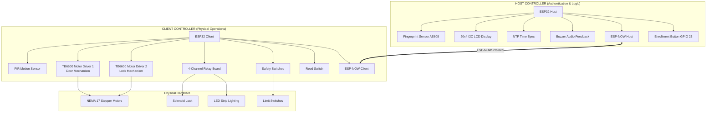
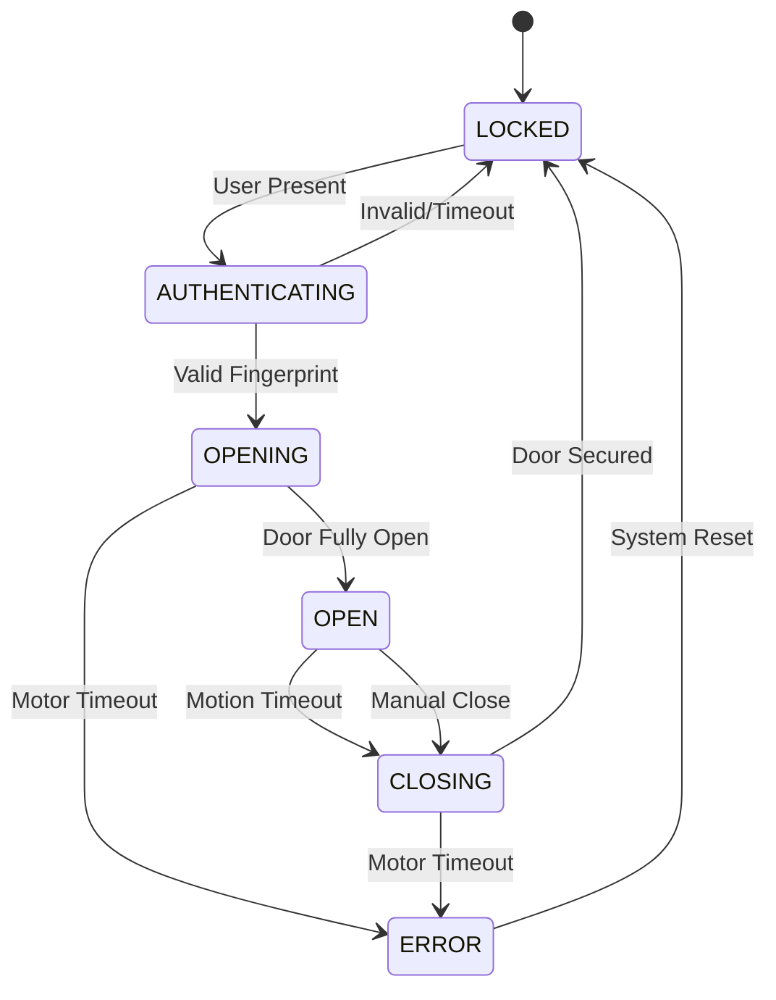
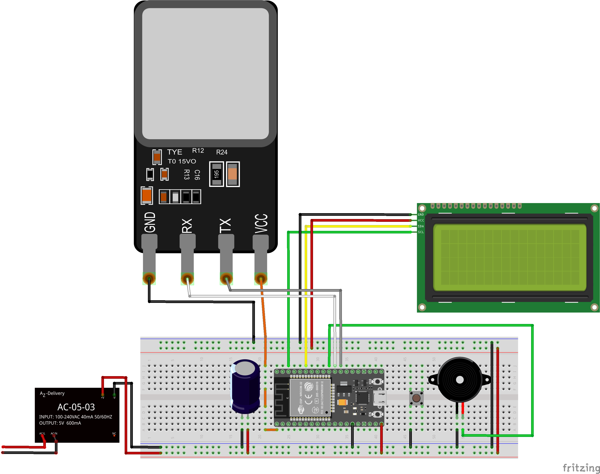

<div align="center">

# Smart Cabinet System

[](https://espressif.com/)
[](https://www.arduino.cc/)
[](LICENSE)
[](https://github.com/qppd/Smart-Cabinet)

**An advanced IoT-enabled secure storage solution with fingerprint authentication, automated mechanisms, and intelligent monitoring.**

*Engineered by [QPPD](https://github.com/qppd) for smart access control and automated storage management.*

</div>

---

## Recent Changes (v2.0)

### October 2025 Update
- ESP-NOW Communication - Replaced WebSocket with ESP-NOW for reliable host-client communication
- Fingerprint Enrollment System - One-button enrollment via tactile button on GPIO 23
- Fixed Authentication Flow - Resolved double-read issue for reliable fingerprint matching
- Improved LCD Display - Eliminated flickering with optimized refresh logic
- Enhanced Buzzer System - Non-blocking PWM-based buzzer with proper timing
- NTP Time Synchronization - Internet-based time display (GMT+8)
- Fingerprint Management - Delete fingerprints and empty database features
- WiFi Integration - Automatic WiFi connection for NTP synchronization
- TactileButton Class - Debounced button handler with press/hold detection
- ESP32 Core 3.1.2 Support - Updated ESP-NOW callbacks for latest Arduino core

---

## Table of Contents

- [Overview](#overview)
- [Key Features](#key-features)
- [System Architecture](#system-architecture)
- [Hardware Requirements](#hardware-requirements)
- [Wiring Diagram](#wiring-diagram)
- [Software Dependencies](#software-dependencies)
- [Installation & Setup](#installation--setup)
- [Configuration](#configuration)
- [Operation Guide](#operation-guide)
- [API & Communication](#api--communication)
- [Testing & Validation](#testing--validation)
- [Troubleshooting](#troubleshooting)
- [Project Structure](#project-structure)
- [Future Enhancements](#future-enhancements)
- [Contributing](#contributing)
- [Support & Contact](#support--contact)
- [License](#license)

---

## Overview

The **Smart Cabinet System** is a sophisticated IoT-enabled secure storage solution designed for environments requiring controlled access and intelligent automation. This dual-controller architecture provides robust security, and seamless user interaction through biometric authentication and automated mechanical operations.

### Project Goals
- **Security**: Multi-layered access control with biometric authentication
- **Automation**: Intelligent operation with minimal user intervention  
- **Safety**: Comprehensive emergency systems and fail-safes
- **Scalability**: Modular design for easy expansion and customization
- **Reliability**: Robust error handling and system recovery

---

## Key Features

### Advanced Security
- **Biometric Authentication**: AS608 fingerprint sensor with 50+ user capacity
- **One-Touch Enrollment**: Simple button-press enrollment system (GPIO 23)
- **Reliable Matching**: Fixed authentication flow for consistent fingerprint recognition
- **Multi-layer Locking**: Electronic solenoid + mechanical stepper motor locks
- **Access Logging**: Real-time authentication tracking and user management
- **Emergency Override**: Manual unlock procedures for critical situations

### Intelligent Automation
- **Smart Motion Detection**: PIR sensor with adaptive sensitivity
- **Auto-Close System**: Configurable timeout (default: 60 seconds)
- **State Management**: Advanced finite state machine for reliable operation

### Safety Systems
- **Emergency Stop**: Immediate motor shutdown via limit switches
- **Position Monitoring**: Reed switch for precise door state detection
- **Fail-Safe Design**: Secure lock state during power failures

### Connectivity
- **ESP-NOW Communication**: Ultra-low latency peer-to-peer communication between controllers
- **WiFi Integration**: Network connectivity for NTP time synchronization

### User Experience
- **Visual Feedback**: 20x4 I2C LCD with flicker-free status information
- **Audio Alerts**: Multi-tone buzzer notifications
- **LED Illumination**: Automatic interior lighting control
- **Time Display**: NTP-synchronized real-time clock with timezone support
- **Simple Enrollment**: One-button fingerprint registration process

---

## System Architecture

### Distributed Controller Design



### Control Flow Architecture



---

## Hardware Requirements

### Microcontrollers
| Component | Specification | Quantity | Purpose |
|-----------|---------------|----------|---------|
| **ESP32 DevKit** | 240MHz, 4MB Flash, WiFi/BT | 2 | Host & Client Controllers |

### Sensors & Input Devices
| Component | Model/Type | Interface | Function |
|-----------|------------|-----------|----------|
| **Fingerprint Sensor** | AS608/R307 | UART (Serial2) | Biometric Authentication |
| **Enrollment Button** | Tactile Push Button | Digital GPIO 23 | Fingerprint Enrollment Trigger |
| **PIR Motion Sensor** | HC-SR501 | Digital GPIO | User Presence Detection |
| **Reed Switch** | Magnetic Contact | Digital GPIO | Door Position Sensing |
| **Limit Switches** | Mechanical NO/NC | Digital GPIO | Motor Safety Limits |

### Actuators & Motor Control
| Component | Specification | Quantity | Application |
|-----------|---------------|----------|-------------|
| **Stepper Motors** | NEMA 17, 1.8°/step | 2 | Door & Lock Mechanisms |
| **TB6600 Drivers** | 4A, 9-42V Input | 2 | Stepper Motor Control |
| **Solenoid Lock** | 12V, Fail-Secure | 1 | Primary Locking Mechanism |
| **4-Channel Relay** | 5V Logic, 10A Contact | 1 | Power Switching Control |

### Display & Feedback
| Component | Specification | Interface | Purpose |
|-----------|---------------|-----------|---------|
| **LCD Display** | 20x4 Character, I2C | I2C Bus | System Status & Messages |
| **Buzzer** | Piezo, 2-5V | PWM GPIO | Audio Feedback |
| **LED Strip** | 12V, Addressable | Relay Control | Interior Illumination |

### Power Requirements
| System Component | Voltage | Current | Notes |
|------------------|---------|---------|-------|
| **ESP32 Controllers** | 5V | 500mA each | Via USB or external supply |
| **Logic Components** | 3.3V/5V | 200mA total | From ESP32 regulation |
| **Stepper Motors** | 12-24V | 2-4A peak | Separate high-power supply |
| **Solenoid & LEDs** | 12V | 1A continuous | Shared with motor supply |

---

### 3D Printed Enclosures

Custom-designed 3D printable components for professional installation and sensor protection.

#### Fingerprint Scanner Components
| Component | File Format | Purpose | Print Time | Material |
|-----------|-------------|---------|------------|----------|
| **Scanner Case** | STL + G-code | AS608/R307 protective enclosure | 2-3 hours | PLA/PETG |
| **Mounting Bracket** | STL + G-code | Secure cabinet attachment | 1-2 hours | PLA/PETG |

**Features:**
- Snap-fit design for easy sensor installation
- Integrated wire management channels
- Professional appearance for user-facing installation
- Pre-sliced G-code available for Creality Ender 3 V3 SE

**Printing Specifications:**
- **Layer Height:** 0.2mm recommended
- **Infill Density:** 20-30% for optimal strength-to-weight ratio
- **Support Material:** Required for overhangs (auto-generated in slicer)
- **Nozzle Temperature:** PLA: 200-210°C, PETG: 230-250°C
- **Bed Temperature:** PLA: 60°C, PETG: 80°C

**Files Location:** All STL and G-code files available in [`model/`](https://github.com/qppd/Smart-Cabinet/tree/main/model) directory

---

### Component Procurement Guide

#### **Microcontrollers & Development Boards**
| Component | Specifications | Supplier | Approximate Cost | Notes |
|-----------|---------------|----------|------------------|--------|
| **ESP32 DevKit V1** | ESP32-WROOM-32, 38-pin | Amazon, AliExpress | $8-15 | Ensure CH340 USB chip |
| **ESP32 DevKit V4** | ESP32-WROOM-32D, 38-pin | Espressif, DigiKey | $12-20 | Official version |

#### **Sensors & Input Devices**
| Component | Model | Specifications | Supplier | Cost |
|-----------|-------|---------------|----------|------|
| **Fingerprint Sensor** | AS608 / R307 | UART, 50 templates | Amazon, AliExpress | $15-25 |
| **PIR Motion Sensor** | HC-SR501 | 3-7m range, 3.3V logic | Amazon, SparkFun | $3-8 |
| **Reed Switch** | MC-38 | Magnetic, NO contact | Amazon, AliExpress | $2-5 |
| **Limit Switches** | KW12-3 | Microswitch, NO/NC | Amazon, McMaster | $3-8 each |
| **Tactile Button** | 12mm | 4-pin, momentary | Amazon, Adafruit | $1-3 |

#### **Motor Control Components**
| Component | Model | Specifications | Supplier | Cost |
|-----------|-------|---------------|----------|------|
| **NEMA 17 Motors** | 17HS4401 | 1.8°, 1.7A, 4-wire | Amazon, StepperOnline | $15-25 each |
| **TB6600 Drivers** | TB6600HG | 4A, 9-42V, 32μstepping | Amazon, AliExpress | $12-20 each |
| **4-Channel Relay** | SRD-05VDC-SL-C | 5V coil, 10A contact | Amazon, AliExpress | $8-15 |
| **Solenoid Lock** | 12V Electric Lock | Fail-secure, 12V DC | Amazon, Security stores | $20-40 |

#### **Display & Interface**
| Component | Model | Specifications | Supplier | Cost |
|-----------|-------|---------------|----------|------|
| **I2C LCD** | 2004A + I2C Module | 20x4, HD44780, 0x27 | Amazon, AliExpress | $8-15 |
| **DS1302 RTC** | DS1302 Module | Real-time clock, battery | Amazon, AliExpress | $3-8 |
| **Piezo Buzzer** | Active/Passive | 3-5V, PCB mount | Amazon, DigiKey | $2-5 |

#### **Power Supply Components**
| Component | Specifications | Supplier | Cost | Notes |
|-----------|---------------|----------|------|--------|
| **Switching PSU** | 12V 5A (60W) | Amazon, Mean Well | $15-30 | Choose reputable brand |
| **Buck Converter** | LM2596 12V→5V 3A | Amazon, AliExpress | $3-8 | Adjustable output |
| **Power Jack** | 5.5×2.1mm DC Jack | Amazon, DigiKey | $2-5 | Panel mount |

#### **Wiring & Connectors**
| Item | Specifications | Supplier | Cost | Quantity |
|------|---------------|----------|------|----------|
| **Hookup Wire** | 22AWG stranded | Amazon, McMaster | $10-20 | 10m spools |
| **Power Wire** | 16AWG stranded | Amazon, McMaster | $15-25 | 5m spool |
| **Dupont Connectors** | 2.54mm pitch | Amazon, AliExpress | $5-10 | 100pc kit |
| **Terminal Blocks** | 3.5mm pitch | Amazon, Phoenix | $10-20 | Various sizes |
| **Heat Shrink** | Assorted sizes | Amazon, 3M | $8-15 | Multi-size kit |

### Total Estimated Cost
| Category | Cost Range |
|----------|------------|
| **Controllers & Sensors** | $60-120 |
| **Motor System** | $80-150 |
| **Power & Wiring** | $40-80 |
| **Enclosure & Mechanical** | $50-150 |
| **Total Project Cost** | **$230-500** |

*Costs vary by supplier, quantity, and quality. Budget for 20% contingency.*

---

## Wiring Diagram

### System Wiring Overview



*Complete system wiring schematic showing HOST and CLIENT controller connections*

### Dual-Controller Architecture

The Smart Cabinet system uses a distributed controller architecture with two ESP32 microcontrollers:

- **HOST Controller (ESP32 #1)**: Handles authentication, user interface, and system coordination
- **CLIENT Controller (ESP32 #2)**: Manages mechanical operations, motor control, and safety systems

Communication between controllers uses **ESP-NOW protocol** for ultra-low latency and reliable peer-to-peer communication.

---

### HOST Controller Connections (ESP32 #1)

#### Display & User Interface
| Component | ESP32 Pin | Wire Color | Connection Details | Voltage |
|-----------|-----------|------------|-------------------|---------|
| **20x4 I2C LCD** | SDA: 21 | Blue | I2C Data Line | 5V |
| | SCL: 22 | Yellow | I2C Clock Line | 5V |
| | VCC | Red | Power Supply | 5V |
| | GND | Black | Common Ground | GND |
| | **I2C Address: 0x27** | | *Use I2C scanner if different* | |

#### Authentication System
| Component | ESP32 Pin | Wire Color | Connection Details | Protocol |
|-----------|-----------|------------|-------------------|----------|
| **AS608 Fingerprint Sensor** | TX2: 17 | Green | UART Transmit | Serial2 |
| | RX2: 16 | White | UART Receive | Serial2 |
| | VCC | Red | Power Supply | 3.3V |
| | GND | Black | Common Ground | GND |
| **Enrollment Button** | GPIO 23 | Orange | Digital Input | Pull-up |
| | GND | Black | Button Common | GND |

#### Real-Time Clock Module
| Component | ESP32 Pin | Wire Color | Connection Details | Interface |
|-----------|-----------|------------|-------------------|-----------|
| **DS1302 RTC** | CE: 0 | Purple | Chip Enable/Reset | Digital |
| | CLK: 19 | Gray | Clock Signal | Digital |
| | DAT: 18 | Brown | Data I/O | Digital |
| | VCC | Red | Power Supply | 5V |
| | GND | Black | Common Ground | GND |

#### Audio Feedback
| Component | ESP32 Pin | Wire Color | Connection Details | Control |
|-----------|-----------|------------|-------------------|---------|
| **Piezo Buzzer** | GPIO 5 | Pink | PWM Signal | LEDC Ch.0 |
| | GND | Black | Common Ground | GND |

#### Power & Communication
| Connection | ESP32 Pin | Wire Color | Specification | Notes |
|------------|-----------|------------|---------------|-------|
| **Power Input** | VIN | Red | 5V DC Input | From buck converter |
| | GND | Black | Common Ground | Shared with all components |
| **ESP-NOW** | Built-in WiFi | | 2.4GHz Radio | Peer-to-peer with CLIENT |

---

### CLIENT Controller Connections (ESP32 #2)

#### Motion Detection
| Component | ESP32 Pin | Wire Color | Connection Details | Type |
|-----------|-----------|------------|-------------------|------|
| **PIR Motion Sensor** | GPIO 34 | Orange | Digital Input | Input-only pin |
| | VCC | Red | Power Supply | 5V |
| | GND | Black | Common Ground | GND |

#### Motor Control System

**TB6600 Stepper Driver #1 (Door/Drawer Motor):**
| Function | ESP32 Pin | TB6600 Pin | Wire Color | Purpose |
|----------|-----------|------------|------------|---------|
| **Direction** | GPIO 2 | DIR+ | Blue | Rotation direction |
| **Step Pulse** | GPIO 4 | PUL+ | Green | Step commands |
| **Enable** | GPIO 15 | ENA+ | White | Driver enable (LOW=active) |
| **Common** | GND | DIR-, PUL-, ENA- | Black | Signal ground |

**TB6600 Stepper Driver #2 (Lock Mechanism Motor):**
| Function | ESP32 Pin | TB6600 Pin | Wire Color | Purpose |
|----------|-----------|------------|------------|---------|
| **Direction** | GPIO 32 | DIR+ | Yellow | Rotation direction |
| **Step Pulse** | GPIO 33 | PUL+ | Orange | Step commands |
| **Enable** | GPIO 5 | ENA+ | Purple | Driver enable (LOW=active) |
| **Common** | GND | DIR-, PUL-, ENA- | Black | Signal ground |

**TB6600 Power Connections:**
| Terminal | Connection | Wire Gauge | Voltage | Current |
|----------|------------|------------|---------|---------|
| **VCC/VDD** | +12V Power | 16 AWG | 12V DC | 4A Max |
| **GND** | Power Ground | 16 AWG | GND | Return |
| **A+, A-** | Motor Phase A | 18 AWG | Motor | 2A |
| **B+, B-** | Motor Phase B | 18 AWG | Motor | 2A |

#### Relay Control System
| Relay | ESP32 Pin | Load Connection | Wire Color | Purpose | Max Load |
|-------|-----------|-----------------|------------|---------|----------|
| **Relay 1** | GPIO 12 | Solenoid Lock | Red | Primary lock mechanism | 10A @ 250V |
| **Relay 2** | GPIO 13 | LED Strip | Blue | Interior illumination | 10A @ 250V |
| **Relay 3** | GPIO 14 | Auxiliary 1 | Green | Future expansion | 10A @ 250V |
| **Relay 4** | GPIO 27 | Auxiliary 2 | Yellow | Future expansion | 10A @ 250V |

**Relay Module Power:**
| Terminal | Connection | Wire Color | Voltage |
|----------|------------|------------|---------|
| **VCC** | +5V | Red | 5V DC |
| **GND** | Ground | Black | GND |
| **JD-VCC** | +5V | Red | Optocoupler power |

#### Safety & Sensors
| Component | ESP32 Pin | Wire Color | Connection Type | Function |
|-----------|-----------|------------|-----------------|----------|
| **Limit Switch MIN** | GPIO 35 | Brown | NO Contact | Minimum position detect |
| **Limit Switch MAX** | GPIO 36 | Orange | NO Contact | Maximum position detect |
| **Reed Switch** | GPIO 39 | Purple | Magnetic Contact | Door closed detection |
| **Common Ground** | GND | Black | Switch Common | All sensor returns |

#### Power & Communication
| Connection | ESP32 Pin | Wire Color | Specification | Notes |
|------------|-----------|------------|---------------|-------|
| **Power Input** | VIN | Red | 5V DC Input | From buck converter |
| | GND | Black | Common Ground | Shared with all components |
| **ESP-NOW** | Built-in WiFi | | 2.4GHz Radio | Peer-to-peer with HOST |

---

### Power Distribution System

```
 Main Power Supply (12V 5A Switching PSU)
├──  TB6600 Motor Driver #1 (12V 2A) ──→  NEMA 17 Door Motor
├──  TB6600 Motor Driver #2 (12V 2A) ──→  NEMA 17 Lock Motor  
├──  Solenoid Lock (12V 1A) ──→ via Relay 1
├──  LED Strip (12V 1A) ──→ via Relay 2
└──  Buck Converter (LM2596) (12V → 5V 3A)
    ├──  ESP32 Host Controller (5V 500mA)
    ├──  ESP32 Client Controller (5V 500mA)
    ├──  20x4 I2C LCD Display (5V 200mA)
    ├──  AS608 Fingerprint Sensor (3.3V 100mA)
    ├──  PIR Motion Sensor (5V 50mA)
    ├──  DS1302 RTC Module (5V 10mA)
    ├──  Piezo Buzzer (5V 20mA)
    ├──  4-Channel Relay Module (5V 150mA)
    └──  Safety Switches & Sensors (5V 50mA)
```

### Connector & Terminal Specifications

#### Recommended Connectors
| Connection Type | Connector | Wire Gauge | Rating |
|-----------------|-----------|------------|--------|
| **Power (12V)** | Terminal Block | 14-16 AWG | 15A |
| **Motor Connections** | Terminal Block | 16-18 AWG | 5A |
| **Signal Wires** | Dupont Connectors | 22-24 AWG | 1A |
| **Sensor Cables** | JST Connectors | 24-26 AWG | 500mA |

#### Wire Color Standards
| Function | Color | Purpose |
|----------|-------|---------|
| **Power (+)** | Red | Positive voltage |
| **Ground (-)** | Black | Ground/negative |
| **Data/Signal** | Various | Digital I/O |
| **I2C SDA** | Blue | I2C data |
| **I2C SCL** | Yellow | I2C clock |
| **UART TX** | Green | Serial transmit |
| **UART RX** | White | Serial receive |

### Assembly Notes

#### Critical Safety Requirements
1. **Isolation**: Keep high-voltage (12V motor) and low-voltage (5V logic) circuits separated
2. **Grounding**: Use common ground point to prevent ground loops
3. **Fusing**: Install appropriate fuses on 12V power lines
4. **Strain Relief**: Secure all cables to prevent disconnection during operation

#### Testing Checklist
- [ ] Verify all power supply voltages before connecting ESP32 controllers
- [ ] Test continuity of all signal connections
- [ ] Confirm proper motor driver configuration (current limiting)
- [ ] Validate safety switch operation (emergency stops)
- [ ] Check ESP-NOW communication range and reliability

### Advanced Wiring Considerations

#### Electromagnetic Interference (EMI) Mitigation

**Motor Noise Suppression:**
```
┌─ Stepper Motor Cable (Shielded)
├─ Ferrite Core (Split-bead, 10-30MHz)
├─ Twisted Pair Wiring (A+/A-, B+/B-)
└─ Shield Connection to Motor Frame Ground

TB6600 Layout:
- Separate analog/digital grounds
- Place 0.1μF ceramic caps near logic pins
- Use 1000μF electrolytic on motor supply
- Keep switching circuits away from ESP32
```

**Signal Integrity Protection:**
```
Critical Signals (I2C, UART, SPI):
├─ Use twisted pair or shielded cable <30cm
├─ Add series resistors (47Ω) for signal damping
├─ Ground shield at one end only (avoid ground loops)
└─ Route away from switching power circuits

Digital Input Protection:
├─ 10kΩ pull-up resistors on all inputs
├─ 100pF ceramic caps for debouncing
├─ TVS diodes for ESD protection (optional)
└─ Optical isolation for noisy environments
```

#### Professional Installation Practices

**Cable Management:**
- Use cable trays or conduit for organized routing
- Maintain 6" separation between power and signal cables
- Label all cables with wire markers or heat shrink labels
- Create service loops for future maintenance access

**Grounding Strategy:**
- Establish single-point ground (star configuration)
- Use heavy gauge wire (12-14 AWG) for ground bus
- Connect all metal enclosures to safety ground
- Install ground fault circuit breaker for AC power

**Environmental Considerations:**
- IP65 rated enclosures for humid environments
- Operating temperature: -10°C to +50°C
- Ventilation for heat dissipation from motor drivers
- Vibration dampening for stepper motor mounting

#### Safety & Code Compliance

**Electrical Safety:**
- Install 5A slow-blow fuse on 12V supply
- Use UL-listed power supplies and enclosures
- Implement emergency stop (E-stop) button
- Ground fault protection for wet locations

**Fire Safety:**
- Use flame-retardant cable jacket materials
- Install thermal protection on motor drivers
- Smoke detection in enclosed installations
- Regular inspection of electrical connections

#### Maintenance & Serviceability

**Test Points & Diagnostics:**
- Install LED indicators for power rails
- Add test points for critical signals
- Include voltage monitoring in software
- Document all modifications and settings

**Spare Parts & Backup:**
- Keep spare ESP32 controllers programmed
- Stock critical sensors (fingerprint, PIR)
- Backup configuration settings to SD card
- Create wiring diagram updates for changes**

### Installation Checklist

#### Pre-Installation Verification
```bash
□ All components tested individually
□ Power supply load tested at full current
□ Cable continuity verified with multimeter
□ Insulation resistance >1MΩ measured
□ Grounding system continuity confirmed
```

#### Installation Steps
```bash
□ Mount ESP32 controllers in protective enclosures
□ Install power distribution (fused and switched)
□ Route and secure all signal cables
□ Connect motor drivers and test without motors
□ Install and calibrate all sensors
□ Perform full system integration test
```

#### Commissioning Tests
```bash
□ Power-on sequence verification
□ ESP-NOW communication test
□ Motor movement and limit switch operation
□ Fingerprint enrollment and authentication
□ Emergency stop and safety system test
□ Long-term reliability test (24-48 hours)
```

---

## Software Dependencies

### Required Arduino Libraries

| Library | Version | Repository | Purpose |
|---------|---------|------------|---------|
| **LiquidCrystal_I2C** | ≥1.1.2 | [johnrickman/LiquidCrystal_I2C](https://github.com/johnrickman/LiquidCrystal_I2C) | I2C LCD Control |
| **Adafruit Fingerprint** | ≥2.1.0 | [adafruit/Adafruit-Fingerprint-Sensor-Library](https://github.com/adafruit/Adafruit-Fingerprint-Sensor-Library) | AS608 Communication |
| **RTClib** | ≥2.1.1 | [adafruit/RTClib](https://github.com/adafruit/RTClib) | DS1302 RTC Interface |
| **ArduinoWebsockets** | ≥0.5.3 | [gilmaimon/ArduinoWebsockets](https://github.com/gilmaimon/ArduinoWebsockets) | WebSocket Communication |
| **ArduinoJson** | ≥6.21.2 | [bblanchon/ArduinoJson](https://github.com/bblanchon/ArduinoJson) | JSON Message Processing |
| **WiFi** | Built-in | ESP32 Core | Network Connectivity |

### Development Environment

| Tool | Version | Download Link |
|------|---------|---------------|
| **Arduino IDE** | ≥2.0.0 | [arduino.cc/software](https://www.arduino.cc/en/software) |
| **ESP32 Board Package** | ≥2.0.9 | [Espressif Arduino Core](https://github.com/espressif/arduino-esp32) |
| **VS Code** (Optional) | Latest | [PlatformIO Extension](https://platformio.org/platformio-ide) |

### Library Installation

**Via Arduino IDE Library Manager:**
```cpp
// Search and install each library:
// 1. LiquidCrystal_I2C by Frank de Brabander
// 2. Adafruit Fingerprint Sensor Library  
// 3. RTClib by Adafruit
// 4. ArduinoWebsockets by Gil Maimon
// 5. ArduinoJson by Benoit Blanchon
```

**Via PlatformIO (platformio.ini):**
```ini
[env:esp32dev]
platform = espressif32
board = esp32dev
framework = arduino
lib_deps = 
    johnrickman/LiquidCrystal_I2C@^1.1.2
    adafruit/Adafruit Fingerprint Sensor Library@^2.1.0
    adafruit/RTClib@^2.1.1
    gilmaimon/ArduinoWebsockets@^0.5.3
    bblanchon/ArduinoJson@^6.21.2
```

---

## Installation & Setup

### Hardware Assembly

#### 1. 3D Print Components (If Using Custom Enclosures)

**Print the Scanner Components:**
```bash
Option A: Use Pre-sliced G-code (Creality Ender 3 V3 SE)
  - Load CE3V3SE_Cabinet_Scanner_Case.gcode
  - Load CE3V3SE_Cabinet_Scanner_Case_Mount.gcode
  - Print with PLA or PETG filament

Option B: Slice STL Files (Any 3D Printer)
  - Import Cabinet_Scanner_Case.stl into your slicer
  - Import Cabinet_Scanner_Case_Mount.stl into your slicer
  - Configure settings: 0.2mm layer height, 20-30% infill
  - Generate and print G-code
```

**Assembly Instructions:**
- Allow printed parts to cool completely before handling
- Test-fit AS608/R307 sensor in scanner case before final assembly
- Clean any support material or stringing from prints
- Optional: Sand and paint for professional finish

#### 2. Mount Controllers and Sensors

1. **Install Fingerprint Scanner**: 
   - Insert AS608 sensor into printed scanner case
   - Secure with snap-fit mechanism or adhesive
   - Attach mounting bracket to cabinet using screws
   - Position at comfortable height for user access (typically 120-150cm)

2. **Mount ESP32 Controllers**: Secure both boards in protective enclosures or chassis

3. **Install Mechanical Components**:
   - Mount stepper motors for door and lock mechanisms
   - Position PIR motion sensor for optimal coverage
   - Install limit switches at mechanical endpoints

#### 3. Power and Wiring

1. **Connect Power**: Wire 12V supply to motor drivers and buck converter  
2. **Wire Sensors**: Follow pin configuration tables for all connections
3. **Cable Management**: Use wire channels in 3D printed parts for clean routing
4. **Test Connections**: Verify continuity and proper voltage levels

### Software Installation

**Clone Repository:**
```bash
git clone https://github.com/qppd/Smart-Cabinet.git
cd Smart-Cabinet
```

**Install Libraries:**
```bash
# If using Arduino IDE:
# 1. Open Library Manager (Ctrl+Shift+I)
# 2. Search and install required libraries listed above

# If using PlatformIO:
pio lib install
```

### Upload Firmware

**HOST Controller (Authentication Unit):**
```bash
# Navigate to host directory
cd source/host/SmartCabinet/

# Configure pins.h with your hardware setup
# Upload via Arduino IDE or PlatformIO to ESP32 #1
```

**CLIENT Controller (Mechanical Unit):**
```bash
# Navigate to client directory  
cd source/client/SmartCabinet/

# Configure client_pins.h with your hardware setup
# Upload via Arduino IDE or PlatformIO to ESP32 #2
```

### Initial System Verification

```bash
# Open Serial Monitor for both controllers
# Verify initialization messages:
# - WiFi connection established
# - All sensors responding
# - WebSocket connection active
# - Motor drivers enabled
```

---

## Configuration

### Network Configuration

**HOST Controller (`source/host/SmartCabinet/pins.h`):**
```cpp
// WiFi Network Settings
static const char* HOST_WIFI_SSID = "YourNetworkName";
static const char* HOST_WIFI_PASSWORD = "YourNetworkPassword";
static const uint16_t HOST_WEBSOCKET_PORT = 81;

// System Timing (milliseconds)
static const unsigned long HOST_DISPLAY_UPDATE_INTERVAL = 1000;
static const unsigned long HOST_FINGERPRINT_CHECK_INTERVAL = 500;
static const unsigned long HOST_STATUS_BROADCAST_INTERVAL = 5000;

// Security Settings
static const uint8_t MAX_FINGERPRINT_ATTEMPTS = 3;
static const unsigned long LOCKOUT_DURATION = 30000; // 30 seconds
static const uint8_t MAX_ENROLLED_FINGERPRINTS = 50;
```

**CLIENT Controller (`source/client/SmartCabinet/client_pins.h`):**
```cpp
// Network Connection
static const char* CLIENT_WIFI_SSID = "YourNetworkName";
static const char* CLIENT_WIFI_PASSWORD = "YourNetworkPassword";
static const char* CLIENT_WEBSOCKET_HOST = "192.168.1.100"; // HOST IP
static const uint16_t CLIENT_WEBSOCKET_PORT = 81;

// Motion & Timing Settings
static const unsigned long CLIENT_MOTION_TIMEOUT = 60000;      // 60 sec auto-close
static const unsigned long CLIENT_MOTOR_TIMEOUT = 30000;       // 30 sec motor limit
static const unsigned long CLIENT_WEBSOCKET_RETRY = 5000;      // 5 sec reconnect

// Motor Configuration (steps)
static const unsigned long CLIENT_DOOR_OPEN_STEPS = 2000;      // Full door travel
static const unsigned long CLIENT_DOOR_CLOSE_STEPS = 2000;
static const unsigned long CLIENT_LOCK_ENGAGE_STEPS = 400;     // Lock mechanism
static const unsigned long CLIENT_LOCK_RELEASE_STEPS = 400;

// Motor Speed (microseconds)
static const unsigned int CLIENT_MOTOR_PULSE_US = 100;         // Pulse width
static const unsigned int CLIENT_MOTOR_GAP_US = 800;           // Speed control
```

### Hardware Calibration

**Motor Step Calculation:**
```cpp
// Formula: Steps = (Degrees / Motor_Step_Angle) * Microstep_Setting
// Example: (90° / 1.8°) * 16 = 800 steps for 90° rotation

// Measure actual travel distances and adjust:
CLIENT_DOOR_OPEN_STEPS = measured_distance_mm * steps_per_mm;
CLIENT_LOCK_ENGAGE_STEPS = lock_rotation_degrees * steps_per_degree;
```

**Sensor Calibration:**
```cpp
// PIR Motion Sensor (adjust via potentiometers):
// - Sensitivity: Set to avoid false triggers
// - Time Delay: Minimum 3 seconds for stable operation

// Reed Switch: Test with magnet at various distances
// Optimal gap: 5-10mm for reliable switching
```

---

##  Operation Guide

### User Authentication Process

1. **Approach Cabinet**: Motion sensor detects user presence
2. **Fingerprint Scan**: Place enrolled finger on AS608 sensor
3. **Processing**: Host controller verifies biometric data (single-pass authentication)
4. **Access Grant**: Valid fingerprint triggers unlock sequence
5. **Automatic Opening**: Client executes door opening mechanism via ESP-NOW

**Authentication Flow:**
-  **Success**: LCD shows "Access Granted!" + ascending beeps + door unlocks
-  **Denied**: LCD shows "Access Denied!" + error beeps (3 short beeps)
- ⏸ **No Finger**: Silent operation (no spam messages)

### Fingerprint Enrollment

**Quick Enrollment Process:**

1. **Press Enrollment Button** (GPIO 23)
   - LCD displays "Starting Enroll..."
   - System auto-assigns next available ID

2. **First Scan**
   - LCD: "Place finger on sensor..."
   - Wait for confirmation beep
   - Hold finger steady on sensor

3. **Remove Finger**
   - LCD: "Remove finger"
   - Wait 2 seconds

4. **Second Scan**
   - LCD: "Place SAME finger again..."
   - Verify fingerprint matches
   
5. **Completion**
   - **Success**: "ENROLLMENT SUCCESS! User ID: X" + 3 ascending beeps
   - **Failed**: "ENROLLMENT FAILED!" + 3 error beeps
   - **Timeout**: 30 seconds if no finger detected

**Enrollment Specifications:**
- **Maximum Users**: 50 fingerprints supported
- **Enrollment Time**: ~15-30 seconds per user
- **Auto ID Assignment**: Based on template count
- **Database Full Check**: Automatic capacity monitoring
- **Template Storage**: Non-volatile sensor memory
- **Button Wiring**: GPIO 23 → Button → GND (internal pullup enabled)

### System Operation States

| State | LED Indicator | Buzzer | Description |
|-------|---------------|---------|-------------|
| **LOCKED** | Off | Silent | Secure state, waiting for user |
| **AUTHENTICATING** | Blinking | Short beep | Processing fingerprint |
| **OPENING** | Steady | Success tone | Door mechanism activating |
| **OPEN** | On | Silent | Cabinet accessible, monitoring motion |
| **CLOSING** | Blinking | Warning tone | Auto-close sequence active |
| **ERROR** | Fast blink | Alarm | System fault, manual intervention required |

###  **Automatic Features**

**Auto-Close System:**
- **Trigger**: 60 seconds of no motion detected
- **Warning**: LED flash and optional buzzer alert
- **Process**: Gradual door closing with safety checks
- **Override**: Motion detection cancels auto-close

**Emergency Stop:**
- **Activation**: Limit switch trigger or manual command
- **Response**: Immediate motor shutdown and error state
- **Recovery**: System reset required after clearing obstruction

---

## API & Communication

### ESP-NOW Protocol

**Communication Details:**
```cpp
// Protocol: ESP-NOW (Espressif's proprietary)
// Latency: <10ms typical
// Range: Up to 200m line-of-sight
// Pairing: MAC address-based peer connection
// Reliability: Automatic retransmission on failure
```

**Advantages over WebSocket:**
- ✅ Ultra-low latency communication
- ✅ No WiFi router dependency
- ✅ Lower power consumption
- ✅ Non-blocking operation
- ✅ Direct peer-to-peer connection

### Message Formats

**ESP-NOW Data Structure:**
```cpp
typedef struct {
    char command[32];      // Command type: "unlock", "authResult", "status"
    int userId;            // User ID from fingerprint
    bool success;          // Success/failure flag
    char data[64];         // Additional data
} ESPNowMessage;
```

**Authentication Event:**
```cpp
// Unlock Command (Host → Client)
{
  "command": "unlock",
  "userId": 12,
  "success": true,
  "data": ""
}

// Authentication Result (Host → Client)
{
  "command": "authResult",
  "userId": 5,
  "success": false,
  "data": "Access Denied"
}
}
```

**System Status:**
```json
{
  "type": "client_status",
  "timestamp": 1640995200000,
  "state": "OPEN",
  "door_open": true,
  "lock_engaged": false,
  "motion_detected": true,
  "reed_switch": false,
  "limit_switches": {
    "min": false,
    "max": false
  },
  "motors": {
    "door_running": false,
    "lock_running": false
  },
  "wifi_rssi": -45
}
```

**Command Messages:**
```json
{
  "type": "command",
  "command": "unlock_and_open",
  "user_id": 12,
  "timestamp": 1640995200000
}
```

### Emergency Commands

```json
{
  "type": "emergency",
  "command": "emergency_stop",
  "reason": "limit_switch_triggered",
  "timestamp": 1640995200000
}
```

### Diagnostic Data

```json
{
  "type": "diagnostic",
  "system_uptime": 3600000,
  "wifi_quality": 85,
  "fingerprint_database": {
    "enrolled_users": 25,
    "max_capacity": 50,
    "last_backup": 1640995200000
  },
  "motor_statistics": {
    "door_cycles": 1250,
    "lock_cycles": 1250,
    "total_runtime_hours": 12.5
  }
}
```

---

## Testing & Validation

### Pre-Deployment Testing

**1. Hardware Verification:**
```bash
# Power Supply Test
- Verify 12V ±5% at motor drivers
- Confirm 5V ±5% at ESP32 controllers
- Check current consumption under load

# Sensor Calibration
- Test fingerprint sensor response time
- Verify motion sensor detection range
- Check reed switch activation distance
- Confirm limit switch trigger points
```

**2. Communication Testing:**
```bash
# Network Connectivity
- WiFi signal strength test (-50 dBm minimum)
- WebSocket connection stability (24-hour test)
- Message latency measurement (<100ms target)

# Inter-Controller Communication
- Command response verification
- Error handling validation  
- Reconnection testing
```

**3. Safety System Validation:**
```bash
# Emergency Stop Testing
- Limit switch activation response (<50ms)
- Manual emergency command (<100ms)
- Power failure recovery testing

# Mechanical Safety
- Door obstruction detection
- Motor stall protection
- Position verification accuracy
```

### Performance Benchmarks

| Metric | Target | Typical | Acceptance |
|--------|---------|---------|------------|
| **Authentication Time** | <2 seconds | 1.2 seconds | <3 seconds |
| **Door Open Time** | <5 seconds | 3.8 seconds | <8 seconds |
| **Door Close Time** | <5 seconds | 3.8 seconds | <8 seconds |
| **Motion Response** | <1 second | 0.3 seconds | <2 seconds |
| **WebSocket Latency** | <100ms | 45ms | <200ms |
| **Emergency Stop** | <50ms | 25ms | <100ms |

### Acceptance Testing Checklist

- [ ] **Power-on self-test passes**
- [ ] **All sensors respond correctly** 
- [ ] **Fingerprint enrollment successful**
- [ ] **Door mechanism operates smoothly**
- [ ] **Auto-close function works**
- [ ] **Emergency stop functions**
- [ ] **Network connectivity stable**
- [ ] **WebSocket communication active**
- [ ] **All safety systems operational**
- [ ] **Error recovery procedures work**

---

## Troubleshooting

### Wiring & Hardware Troubleshooting

#### Step-by-Step Connection Verification

**1. Power System Check:**
```bash
□ Main 12V supply: 11.5V - 12.5V (use multimeter)
□ Buck converter output: 4.9V - 5.1V  
□ ESP32 3.3V rail: 3.2V - 3.4V
□ All ground connections secure and continuous
□ No short circuits between power rails
```

**2. HOST Controller Verification:**
```bash
□ I2C LCD: SDA=21, SCL=22, Address 0x27
□ AS608 Sensor: TX2=17, RX2=16, 3.3V power
□ DS1302 RTC: CE=0, CLK=19, DAT=18, 5V power  
□ Buzzer: GPIO 5, active high
□ Enrollment Button: GPIO 23, pull-up enabled
```

**3. CLIENT Controller Verification:**  
```bash
□ PIR Sensor: GPIO 34 (input-only), 5V power
□ TB6600 #1: DIR=2, STEP=4, ENABLE=15
□ TB6600 #2: DIR=32, STEP=33, ENABLE=5
□ Relays: GPIO 12,13,14,27 (HIGH = active)
□ Limit Switches: GPIO 35,36 (pull-up, NO contacts)
□ Reed Switch: GPIO 39 (input-only, magnetic)
```

**4. Communication Test:**
```bash
Serial Monitor Commands:
HOST: "ESP-NOW: Host initialized"
CLIENT: "ESP-NOW: Client paired"
Both: "WiFi connected" (if using WiFi features)
```

#### Common Wiring Problems

**Issue: I2C LCD Not Working**
```bash
Symptoms: Blank display, garbled text, no backlight
Troubleshooting:
□ Verify I2C address with scanner: Wire.begin(); Wire.scan()
□ Check SDA/SCL connections (GPIO 21/22)
□ Test with 3.3V instead of 5V (some modules require 3.3V)
□ Ensure pull-up resistors present (usually on module)
Solutions:
- Try different I2C address (0x3F common alternative)
- Swap SDA/SCL if communication fails
- Add external 4.7kΩ pull-up resistors if needed
```

**Issue: Stepper Motors Erratic/Not Moving**
```bash
Symptoms: Jittery movement, wrong direction, no movement
Troubleshooting:
□ Check TB6600 DIP switch settings (current, decay mode)
□ Verify motor wiring: A+,A-,B+,B- to driver
□ Measure STEP signal: should show 3.3V pulses
□ Test ENABLE pin: LOW=enabled, HIGH=disabled
Solutions:
- Set TB6600 current to 1.5A (switches 5,6,7 = OFF,ON,OFF)
- Swap motor phase wires if direction incorrect
- Check step pulse timing (minimum 2.5μs pulse width)
```

**Issue: Fingerprint Sensor Communication Error**
```bash
Symptoms: "Sensor not found", incorrect readings
Troubleshooting:
□ Verify power: 3.3V (NOT 5V - can damage sensor)
□ Check UART wiring: ESP32 TX2→Sensor RX, ESP32 RX2→Sensor TX
□ Test baud rate: default 57600, try 9600 if issues
□ Ensure common ground connection
Solutions:
- Use voltage divider if accidentally connected to 5V
- Try hardware serial pins 1,3 instead of 16,17
- Reset sensor by power cycling
```

**Issue: ESP-NOW Communication Failed**
```bash
Symptoms: Controllers not communicating, timeout errors
Troubleshooting:
□ Both ESP32s on same WiFi channel
□ MAC addresses correctly configured
□ Distance <50 meters, clear line of sight
□ No interference from other 2.4GHz devices
Solutions:
- Scan and print MAC addresses: WiFi.macAddress()
- Force same WiFi channel with WiFi.channel()
- Use external antennas for better range
```

**Issue: Safety Switches Not Working**
```bash
Symptoms: Limit switches ignored, motors don't stop
Troubleshooting:
□ Check switch type: NO (Normally Open) required
□ Verify pull-up resistors enabled in code
□ Test switch continuity with multimeter
□ Ensure GPIO pins not shared with other functions
Solutions:
- Add external 10kΩ pull-up resistors
- Use interrupt-driven detection for faster response
- Test with LED to verify switch operation
```

#### Wiring Best Practices

**Signal Integrity:**
- Keep motor power wires away from signal wires (>2cm separation)
- Use twisted pairs for stepper motor connections
- Add ferrite cores on motor cables to reduce EMI
- Shield sensitive analog signals (if any added later)

**Power Distribution:**
- Use star grounding (single ground point) to prevent ground loops
- Add 100μF capacitors near each ESP32 for power stability  
- Install 1000μF capacitor on 12V rail for motor current spikes
- Use adequate wire gauge: 16AWG for 12V, 22AWG for 5V signals

**Connector Reliability:**
- Solder all permanent connections (avoid breadboards)
- Use screw terminals for high-current connections (>1A)
- Apply heat shrink tubing to all solder joints
- Label all wires with wire markers or heat-shrink labels

### Common Issues & Solutions

#### Power & Connectivity Issues

**Problem: ESP32 Controller Not Starting**
```bash
Symptoms: No serial output, LED indicators off
Diagnosis:
  - Check 5V power supply (measure with multimeter)
  - Verify USB cable connectivity
  - Test with known-good power source
Solutions:
  - Replace power supply if voltage <4.75V or >5.25V
  - Try different USB cable/port
  - Check for short circuits in wiring
```

**Problem: WiFi Connection Fails**
```bash
Symptoms: "WiFi connection failed" in serial monitor
Diagnosis:
  - Verify network credentials in configuration
  - Check WiFi signal strength (>-70 dBm)
  - Test with mobile hotspot
Solutions:
  - Update CLIENT_WIFI_SSID and CLIENT_WIFI_PASSWORD
  - Move device closer to router
  - Use 2.4GHz network (ESP32 limitation)
```

#### Motor & Mechanical Issues

**Problem: Stepper Motors Not Moving**
```bash
Symptoms: No motor movement, grinding sounds
Diagnosis:
  - Check TB6600 power supply (12-24V)
  - Verify STEP/DIR signal wiring
  - Test ENABLE pin state (LOW = enabled)
Solutions:
  - Measure motor supply voltage
  - Swap STEP/DIR pins if direction inverted
  - Check ENABLE pin connection (Pin 15 for Motor 1)
```

**Problem: Door Doesn't Close Properly**
```bash
Symptoms: Reed switch doesn't trigger, positioning errors
Diagnosis:
  - Check reed switch/magnet alignment
  - Verify step count accuracy
  - Test for mechanical obstructions
Solutions:
  - Adjust magnet position (5-10mm optimal gap)
  - Recalibrate CLIENT_DOOR_CLOSE_STEPS
  - Lubricate door mechanism
```

#### Sensor & Detection Issues

**Problem: Fingerprint Sensor Not Responding**
```bash
Symptoms: "Fingerprint sensor NOT found" error
Diagnosis:
  - Check Serial2 wiring (RX2:16, TX2:17)
  - Verify sensor power (3.3V or 5V depending on model)
  - Test with simple sensor library example
Solutions:
  - Swap RX/TX connections if needed
  - Check sensor power requirements
  - Replace sensor if hardware failure confirmed
```

**Problem: Motion Sensor False Triggers**
```bash
Symptoms: Excessive motion detection, auto-close not working
Diagnosis:
  - Check PIR sensor sensitivity setting
  - Verify mounting position and angle
  - Test ambient temperature variations
Solutions:
  - Adjust sensitivity potentiometer clockwise
  - Mount away from heat sources/air vents
  - Increase debounce time in software
```

#### Communication Issues

**Problem: WebSocket Connection Drops**
```bash
Symptoms: Intermittent connectivity, command delays
Diagnosis:
  - Monitor WiFi signal strength over time
  - Check router logs for disconnections
  - Verify WebSocket server on host
Solutions:
  - Implement longer reconnection timeout
  - Add WiFi signal quality monitoring
  - Use static IP assignment for stability
```

### Diagnostic Tools

#### Serial Monitor Commands
```cpp
// Add to main loop for debugging:
if (Serial.available()) {
  String command = Serial.readString();
  
  if (command == "test_motors") testMotorMovement();
  if (command == "check_sensors") printSensorStatus();
  if (command == "wifi_status") printWiFiDiagnostics();
  if (command == "reset_system") ESP.restart();
}
```

#### Hardware Testing Procedures

**Voltage Testing Points:**
```bash
# Power Supply Verification
Main Supply: 12V ±0.6V (11.4V - 12.6V acceptable)
ESP32 VIN: 5V ±0.25V (4.75V - 5.25V acceptable)  
ESP32 3.3V: 3.3V ±0.15V (3.15V - 3.45V acceptable)

# Signal Testing
STEP Pins: 0V/3.3V square wave during movement
DIR Pins: Steady 0V or 3.3V (direction dependent)
ENABLE Pins: 0V = enabled, 3.3V = disabled
```

**Sensor Verification:**
```bash
# Fingerprint Sensor (AS608)
Power: 3.3V or 5V (check sensor specification)
Communication: 57600 baud UART
Response: Sensor should respond to verifySensor() call

# Motion Sensor (PIR)  
Power: 5V (3.3V may work but reduced sensitivity)
Output: HIGH when motion detected, LOW when idle
Timing: 3-300 second trigger duration (adjustable)

# Reed Switch
Resistance: <1Ω closed, >10MΩ open
Activation: Magnet within 5-10mm distance
Wiring: Normally open contact to ESP32 input
```

### 📞 **Getting Additional Help**

If you encounter issues not covered here:

1. **Check Serial Output**: Enable debug mode and capture full startup sequence
2. **Document Error Messages**: Note exact error text and conditions when it occurs
3. **Test Individual Components**: Isolate issue to specific hardware/software component
4. **Create Minimal Test Case**: Simplify setup to reproduce issue consistently
5. **Contact Support**: Use information below with detailed problem description

---

## Project Structure

```
Smart-Cabinet/
├── 📁 source/
│   ├── 📁 host/SmartCabinet/              # HOST Controller (Authentication)
│   │   ├── SmartCabinet.ino               # Main host program
│   │   ├── pins.h                         # Host pin configuration
│   │   ├── I2CLcd.h/.cpp                  # LCD display driver
│   │   ├── FingerprintAS608.h/.cpp        # Biometric sensor interface
│   │   ├── DS1302Rtc.h/.cpp               # Real-time clock module
│   │   ├── Buzzer.h/.cpp                  # Audio feedback system
│   │   └── WebSocketServer.h/.cpp         # Network communication server
│   │
│   └── 📁 client/SmartCabinet/            # CLIENT Controller (Mechanical)
│       ├── SmartCabinet.ino               # Main client program  
│       ├── client_pins.h                  # Client pin configuration
│       ├── MotionSensor.h/.cpp            # PIR motion detection
│       ├── TB6600.h/.cpp                  # Stepper motor drivers
│       ├── Relay4.h/.cpp                  # Relay board control
│       ├── LimitSwitch.h/.cpp             # Safety switch handling
│       ├── ReedSwitch.h/.cpp              # Position sensing
│       ├── WebSocketClient.h/.cpp         # Network communication client
│       └── README.md                      # Client-specific documentation
│
├── 📁 diagram/                            # System Documentation
│   └── img20.jpg                          # Complete wiring diagram
│
├── 📁 model/                              # Design & 3D Models
│   ├── Cabinet_Scanner_Case.png           # Scanner case design preview
│   ├── Cabinet_Scanner_Case.stl           # 3D printable fingerprint scanner enclosure
│   ├── Cabinet_Scanner_Case_Mount.png     # Scanner mount design preview
│   ├── Cabinet_Scanner_Case_Mount.stl     # 3D printable mounting bracket
│   ├── CE3V3SE_Cabinet_Scanner_Case.gcode # Ready-to-print scanner case (Creality Ender 3 V3 SE)
│   ├── CE3V3SE_Cabinet_Scanner_Case_Mount.gcode # Ready-to-print mount (Creality Ender 3 V3 SE)
│   ├── SmartCabinet v0.png                # Initial concept design
│   ├── SmartCabinet v03.png               # Design iteration 3
│   └── SmartCabinet v4.png                # Final design version
│
├── README.md                              # Main project documentation
└── LICENSE                                # Project license file
```

### Architecture Overview

**HOST Controller Components:**
- `SmartCabinet.ino`: Main application logic and state management
- `I2CLcd.*`: 20x4 character display driver with I2C interface
- `FingerprintAS608.*`: Biometric sensor communication and authentication
- `DS1302Rtc.*`: Real-time clock for timestamp and scheduling
- `Buzzer.*`: PWM-driven audio feedback system  
- `WebSocketServer.*`: Network communication hub

**CLIENT Controller Components:**
- `SmartCabinet.ino`: Mechanical control and safety systems
- `MotionSensor.*`: PIR motion detection with debouncing
- `TB6600.*`: Stepper motor control with non-blocking operation
- `Relay4.*`: Multi-channel relay board for high-power switching
- `LimitSwitch.*`: Safety switch monitoring with interrupt handling
- `ReedSwitch.*`: Magnetic door position sensing
- `WebSocketClient.*`: Network communication with auto-reconnection

### Component Responsibilities

| Component | Primary Function | Secondary Function |
|-----------|------------------|-------------------|
| **HOST Controller** | User authentication & interface | System coordination & logging |
| **CLIENT Controller** | Mechanical operations & safety | Environmental monitoring |
| **WebSocket Layer** | Real-time communication | Status reporting & diagnostics |
| **Safety Systems** | Emergency protection | Preventive maintenance alerts |
| **Motor Control** | Precise positioning | Load monitoring & protection |

---

## Future Enhancements

### Mobile Application Integration
- **Native App Development**: iOS/Android companion app for remote monitoring
- **Push Notifications**: Real-time alerts for security events and system status
- **Remote Control**: Emergency unlock and system management capabilities
- **User Management**: Fingerprint enrollment and access control via mobile interface

### Advanced AI Features
- **Behavioral Analytics**: Machine learning-based user pattern recognition
- **Predictive Maintenance**: AI-driven component health monitoring and failure prediction
- **Adaptive Security**: Dynamic access control based on time, location, and user behavior
- **Voice Control**: Integration with voice assistants for hands-free operation

### Enhanced Security Systems
- **Multi-Factor Authentication**: Combination of fingerprint, RFID, and PIN verification
- **Facial Recognition**: Computer vision-based secondary authentication
- **Tamper Detection**: Advanced intrusion detection with immediate alert systems
- **Encrypted Communication**: End-to-end encryption for all network communications

### IoT Ecosystem Integration
- **Home Automation**: Integration with existing smart home platforms (Home Assistant, OpenHAB)
- **Cloud Connectivity**: Secure cloud backup and remote access capabilities
- **API Gateway**: RESTful API for third-party system integration
- **Dashboard Interface**: Web-based management interface for system administration

### Performance Optimizations
- **Edge Computing**: Local AI processing for faster response times
- **Energy Management**: Advanced power saving modes and solar charging compatibility
- **Wireless Charging**: Contactless power delivery for maintenance-free operation
- **Mesh Networking**: Multi-device communication for scaled deployments

### User Experience Improvements
- **Customizable Interface**: Themeable LCD displays and configurable audio feedback
- **Multi-Language Support**: Internationalization for global deployment
- **Accessibility Features**: Voice prompts and tactile feedback for visually impaired users
- **Progressive Web App**: Browser-based configuration and monitoring interface

---

## Contributing

We welcome contributions from the community! Here's how you can help improve the Smart Cabinet System:

### Development Setup

1. **Fork the Repository**
   ```bash
   git clone https://github.com/qppd/Smart-Cabinet.git
   cd Smart-Cabinet
   git checkout -b feature/your-feature-name
   ```

2. **Development Environment**
   ```bash
   # Install required tools
   - Arduino IDE 2.0+ or PlatformIO
   - ESP32 Board Package
   - Required libraries (see dependencies section)
   ```

3. **Testing Setup**
   ```bash
   # Hardware requirements for testing
   - 2x ESP32 development boards
   - Breadboard and jumper wires for prototyping
   - Basic multimeter for voltage verification
   ```

### Contribution Guidelines

**Code Standards:**
- Follow Arduino/C++ naming conventions
- Add comprehensive comments for complex logic
- Include header documentation for all new functions
- Maintain consistent indentation (2 spaces)

**Documentation:**
- Update README.md for new features
- Add inline code comments for complex algorithms
- Include wiring diagrams for hardware changes
- Provide configuration examples

**Testing Requirements:**
- Test all new features on actual hardware
- Verify compatibility with existing functionality
- Include performance benchmarks for optimizations
- Document any breaking changes

### Priority Areas for Contribution

1. **Hardware Drivers**: New sensor and actuator support
2. **Communication Protocols**: Additional network interfaces
3. **Security Features**: Enhanced authentication methods
4. **User Interface**: Improved display and interaction systems
5. **Documentation**: Installation guides and troubleshooting
6. **Testing**: Automated testing frameworks and validation scripts

### Submission Process

1. **Create Feature Branch**: Use descriptive branch names
2. **Implement Changes**: Follow coding standards and add tests
3. **Update Documentation**: Include relevant documentation updates
4. **Submit Pull Request**: Provide detailed description of changes
5. **Review Process**: Collaborate with maintainers on feedback
6. **Merge Approval**: Final testing and integration

---

## Support & Contact

### Project Maintainer

**QPPD (Sajed Mendoza)**
- Portfolio: [sajed-mendoza.onrender.com](https://sajed-mendoza.onrender.com)
- GitHub: [@qppd](https://github.com/qppd)
- Email: quezon.province.pd@gmail.com

### Community & Social

- Facebook Developer Page: [QPPD Dev](https://facebook.com/qppd.dev)
- Organization: [Quezon Province Programmer/Developers](https://facebook.com/QUEZONPROVINCEDEVS)

### Technical Support

For Technical Issues:
1. **Search Existing Issues**: Check [GitHub Issues](https://github.com/qppd/Smart-Cabinet/issues)
2. **Create New Issue**: Use provided templates for bug reports or feature requests
3. **Include Information**: Hardware setup, error messages, and reproduction steps
4. **Response Time**: 24-48 hours for initial response

For General Questions:
- **Email Support**: Include "Smart Cabinet" in subject line
- **Community Forum**: Post in Facebook developer group
- **Live Chat**: Available on portfolio website during business hours

### Additional Resources

#### 3D Printable Components

All 3D models are available in the [model directory](https://github.com/qppd/Smart-Cabinet/tree/main/model) with ready-to-print files.

**Fingerprint Scanner Enclosure:**
- **Files Available:**
  - `Cabinet_Scanner_Case.stl` - 3D model for any slicer software
  - `Cabinet_Scanner_Case.png` - Preview/reference image
  - `CE3V3SE_Cabinet_Scanner_Case.gcode` - Pre-sliced for Creality Ender 3 V3 SE
  
- **Purpose:** Protective enclosure for AS608/R307 fingerprint sensor
- **Features:**
  - Secure sensor mounting with snap-fit design
  - Wire management channels for clean installation
  - Professional appearance for cabinet integration
  - Compatible with standard fingerprint sensor modules

**Scanner Mounting Bracket:**
- **Files Available:**
  - `Cabinet_Scanner_Case_Mount.stl` - 3D model for any slicer software
  - `Cabinet_Scanner_Case_Mount.png` - Preview/reference image
  - `CE3V3SE_Cabinet_Scanner_Case_Mount.gcode` - Pre-sliced for Creality Ender 3 V3 SE
  
- **Purpose:** Secure mounting bracket for scanner case attachment
- **Features:**
  - Adjustable positioning for optimal finger placement
  - Screw mounting points for permanent installation
  - Compatible with various cabinet materials
  - Lightweight yet sturdy construction

**Printing Recommendations:**
- **Material:** PLA or PETG recommended
- **Layer Height:** 0.2mm for optimal detail
- **Infill:** 20-30% for structural integrity
- **Supports:** May be required depending on orientation
- **Print Time:** Scanner case ~2-3 hours, mount ~1-2 hours

**Design Iterations:**
- `SmartCabinet v0.png` - Initial concept and planning
- `SmartCabinet v03.png` - Refined design with improvements
- `SmartCabinet v4.png` - Final production-ready design

## License

### MIT License

```
MIT License

Copyright (c) 2025 QPPD (Sajed Mendoza)

Permission is hereby granted, free of charge, to any person obtaining a copy
of this software and associated documentation files (the "Software"), to deal
in the Software without restriction, including without limitation the rights
to use, copy, modify, merge, publish, distribute, sublicense, and/or sell
copies of the Software, and to permit persons to whom the Software is
furnished to do so, subject to the following conditions:

The above copyright notice and this permission notice shall be included in all
copies or substantial portions of the Software.

THE SOFTWARE IS PROVIDED "AS IS", WITHOUT WARRANTY OF ANY KIND, EXPRESS OR
IMPLIED, INCLUDING BUT NOT LIMITED TO THE WARRANTIES OF MERCHANTABILITY,
FITNESS FOR A PARTICULAR PURPOSE AND NONINFRINGEMENT. IN NO EVENT SHALL THE
AUTHORS OR COPYRIGHT HOLDERS BE LIABLE FOR ANY CLAIM, DAMAGES OR OTHER
LIABILITY, WHETHER IN AN ACTION OF CONTRACT, TORT OR OTHERWISE, ARISING FROM,
OUT OF OR IN CONNECTION WITH THE SOFTWARE OR THE USE OR OTHER DEALINGS IN THE
SOFTWARE.
```

### License Terms

**Permissions:**
- Modification: Customize and extend functionality
- Distribution: Share modified versions with others
- Private Use: Use for personal projects and learning

**Conditions:**
- License Notice: Include original license in distributions
- Copyright Notice: Credit original author in derivative works

**Limitations:**
- Warranty: Software provided "as-is" without guarantees

### Educational Use

This project is specifically designed to be educational and learning-friendly:

- **Academic Projects**: Free use in schools, universities, and research institutions
- **STEM Education**: Encourage use in robotics and IoT curriculum  
- **Maker Spaces**: Support community workshops and maker initiatives
- **Open Source**: Promote collaborative development and knowledge sharing

### Commercial Licensing

For commercial deployments requiring additional support or custom licensing:

- **Volume Licensing**: Special terms for large-scale deployments
- **OEM Integration**: White-label licensing for product manufacturers

**Contact**: quezon.province.pd@gmail.com for commercial licensing inquiries.

---

<div align="center">

### Thank you for choosing Smart Cabinet System!

*Building the future of secure, intelligent storage solutions.*

**Star this repository if it helped you!**


</div>
