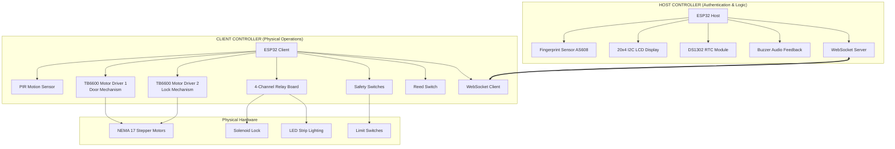
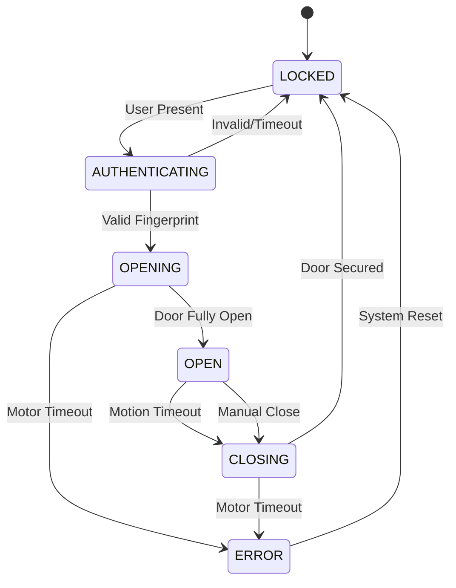

<div align="center">

# 🔒 Smart Cabinet System

[](https://espressif.com/)
[](https://www.arduino.cc/)
[](LICENSE)
[](https://github.com/qppd/Smart-Cabinet)

**An advanced IoT-enabled secure storage solution with fingerprint authentication, automated mechanisms, and intelligent monitoring.**

*Engineered by [QPPD](https://github.com/qppd) for smart access control and automated storage management.*

</div>

---

## 🔄 Recent Changes (v2.0)

### October 2025 Update
- ✅ **Replaced DS1302 RTC with NTP** - Internet-based time synchronization (GMT+8)
- ✅ **Added Fingerprint Management** - Delete fingerprints and empty database features
- ✅ **Improved Buzzer System** - Non-blocking PWM-based buzzer with proper timing
- ✅ **WiFi Integration** - Automatic WiFi connection with credential management
- ✅ **WebSocket Server** - Real-time communication between host and client (under development)
- ✅ **Enhanced Error Handling** - Better debugging and crash prevention
- ⚠️ **Known Issue**: WebSocket blocking - considering ESP-NOW as alternative

---

## 📖 Table of Contents

- [🌟 Overview](#-overview)
- [✨ Key Features](#-key-features)
- [🏗️ System Architecture](#️-system-architecture)
- [📦 Hardware Requirements](#-hardware-requirements)
- [🔌 Wiring Diagram](#-wiring-diagram)
- [⚙️ Software Dependencies](#️-software-dependencies)
- [🚀 Installation & Setup](#-installation--setup)
- [📋 Configuration](#-configuration)
- [🎮 Operation Guide](#-operation-guide)
- [🔧 API & Communication](#-api--communication)
- [🧪 Testing & Validation](#-testing--validation)
- [🛠️ Troubleshooting](#️-troubleshooting)
- [📁 Project Structure](#-project-structure)
- [🔮 Future Enhancements](#-future-enhancements)
- [🤝 Contributing](#-contributing)
- [📞 Support & Contact](#-support--contact)
- [📄 License](#-license)

---

## 🌟 Overview

The **Smart Cabinet System** is a sophisticated IoT-enabled secure storage solution designed for environments requiring controlled access and intelligent automation. This dual-controller architecture provides robust security, and seamless user interaction through biometric authentication and automated mechanical operations.

### 🎯 Project Goals
- **Security**: Multi-layered access control with biometric authentication
- **Automation**: Intelligent operation with minimal user intervention  
- **Safety**: Comprehensive emergency systems and fail-safes
- **Scalability**: Modular design for easy expansion and customization
- **Reliability**: Robust error handling and system recovery

---

## ✨ Key Features

### 🔐 **Advanced Security**
- **Biometric Authentication**: AS608 fingerprint sensor with 50+ user capacity
- **Multi-layer Locking**: Electronic solenoid + mechanical stepper motor locks
- **Access Logging**: Real-time authentication tracking and user management
- **Emergency Override**: Manual unlock procedures for critical situations

### 🤖 **Intelligent Automation**  
- **Smart Motion Detection**: PIR sensor with adaptive sensitivity
- **Auto-Close System**: Configurable timeout (default: 60 seconds)
- **State Management**: Advanced finite state machine for reliable operation

### 🛡️ **Safety Systems**
- **Emergency Stop**: Immediate motor shutdown via limit switches
- **Position Monitoring**: Reed switch for precise door state detection
- **Fail-Safe Design**: Secure lock state during power failures

### 🌐 **Connectivity**
- **WebSocket Communication**: Real-time bidirectional data exchange

### 💡 **User Experience**
- **Visual Feedback**: 20x4 I2C LCD with status information
- **Audio Alerts**: buzzer notifications
- **LED Illumination**: Automatic interior lighting control
- **Time Display**: Real-time clock for timestamp logging

---

## 🏗️ System Architecture

### 📡 **Distributed Controller Design**



### 🧠 **Control Flow Architecture**



---

## 📦 Hardware Requirements

### 🖥️ **Microcontrollers**
| Component | Specification | Quantity | Purpose |
|-----------|---------------|----------|---------|
| **ESP32 DevKit** | 240MHz, 4MB Flash, WiFi/BT | 2 | Host & Client Controllers |

### 🔍 **Sensors & Input Devices**  
| Component | Model/Type | Interface | Function |
|-----------|------------|-----------|----------|
| **Fingerprint Sensor** | AS608/R307 | UART (Serial2) | Biometric Authentication |
| **PIR Motion Sensor** | HC-SR501 | Digital GPIO | User Presence Detection |
| **Reed Switch** | Magnetic Contact | Digital GPIO | Door Position Sensing |
| **Limit Switches** | Mechanical NO/NC | Digital GPIO | Motor Safety Limits |

### ⚙️ **Actuators & Motor Control**
| Component | Specification | Quantity | Application |
|-----------|---------------|----------|-------------|
| **Stepper Motors** | NEMA 17, 1.8°/step | 2 | Door & Lock Mechanisms |
| **TB6600 Drivers** | 4A, 9-42V Input | 2 | Stepper Motor Control |
| **Solenoid Lock** | 12V, Fail-Secure | 1 | Primary Locking Mechanism |
| **4-Channel Relay** | 5V Logic, 10A Contact | 1 | Power Switching Control |

### 📱 **Display & Feedback**
| Component | Specification | Interface | Purpose |
|-----------|---------------|-----------|---------|
| **LCD Display** | 20x4 Character, I2C | I2C Bus | System Status & Messages |
| **Buzzer** | Piezo, 2-5V | PWM GPIO | Audio Feedback |
| **LED Strip** | 12V, Addressable | Relay Control | Interior Illumination |

### 🔌 **Power Requirements**
| System Component | Voltage | Current | Notes |
|------------------|---------|---------|-------|
| **ESP32 Controllers** | 5V | 500mA each | Via USB or external supply |
| **Logic Components** | 3.3V/5V | 200mA total | From ESP32 regulation |
| **Stepper Motors** | 12-24V | 2-4A peak | Separate high-power supply |
| **Solenoid & LEDs** | 12V | 1A continuous | Shared with motor supply |

---

## 🔌 Wiring Diagram

### 📊 **System Wiring Overview**


*Complete system wiring schematic showing HOST and CLIENT controller connections*

### 🔗 **HOST Controller Connections (ESP32 #1)**

| Component | ESP32 Pin | Connection Details |
|-----------|-----------|-------------------|
| **I2C LCD** | SDA: 21, SCL: 22 | Standard I2C bus (address 0x27) |
| **Fingerprint Sensor** | RX2: 16, TX2: 17 | Hardware Serial2 communication |
| **DS1302 RTC** | CE: 0, CLK: 18, DAT: 5 | SPI-like interface |
| **Buzzer** | PWM: 25 | LEDC channel 0 for tone generation |
| **Power** | VIN: 5V, GND: Common | Shared ground with all components |

### 🔗 **CLIENT Controller Connections (ESP32 #2)**

| Function | ESP32 Pin | Component | Notes |
|----------|-----------|-----------|-------|
| **Motion Sensor** | GPIO 34 | PIR HC-SR501 | Input-only pin, pull-up enabled |
| **Door Motor** | DIR: 2, STEP: 4, EN: 15 | TB6600 Driver #1 | Enable LOW = active |
| **Lock Motor** | DIR: 32, STEP: 33, EN: 5 | TB6600 Driver #2 | Enable LOW = active |
| **Relay Control** | 12, 13, 14, 27 | 4-Channel Module | HIGH = relay active |
| **Safety Switches** | 35, 36 | Limit Switches | Pull-up enabled, NO contacts |
| **Reed Switch** | GPIO 39 | Magnetic Contact | Input-only pin |

### ⚡ **Power Distribution**

```
Main Power Supply (12V 5A)
├── TB6600 Motor Drivers (12V 4A)
├── Solenoid Lock (12V 1A)  
├── LED Strip (12V 1A)
└── Buck Converter (12V → 5V 2A)
    ├── ESP32 Host Controller (5V 500mA)
    ├── ESP32 Client Controller (5V 500mA)  
    ├── Sensors & Logic (5V 200mA)
    └── LCD & Buzzer (5V 100mA)
```

---

## ⚙️ Software Dependencies

### 📚 **Required Arduino Libraries**

| Library | Version | Repository | Purpose |
|---------|---------|------------|---------|
| **LiquidCrystal_I2C** | ≥1.1.2 | [johnrickman/LiquidCrystal_I2C](https://github.com/johnrickman/LiquidCrystal_I2C) | I2C LCD Control |
| **Adafruit Fingerprint** | ≥2.1.0 | [adafruit/Adafruit-Fingerprint-Sensor-Library](https://github.com/adafruit/Adafruit-Fingerprint-Sensor-Library) | AS608 Communication |
| **RTClib** | ≥2.1.1 | [adafruit/RTClib](https://github.com/adafruit/RTClib) | DS1302 RTC Interface |
| **ArduinoWebsockets** | ≥0.5.3 | [gilmaimon/ArduinoWebsockets](https://github.com/gilmaimon/ArduinoWebsockets) | WebSocket Communication |
| **ArduinoJson** | ≥6.21.2 | [bblanchon/ArduinoJson](https://github.com/bblanchon/ArduinoJson) | JSON Message Processing |
| **WiFi** | Built-in | ESP32 Core | Network Connectivity |

### 🛠️ **Development Environment**

| Tool | Version | Download Link |
|------|---------|---------------|
| **Arduino IDE** | ≥2.0.0 | [arduino.cc/software](https://www.arduino.cc/en/software) |
| **ESP32 Board Package** | ≥2.0.9 | [Espressif Arduino Core](https://github.com/espressif/arduino-esp32) |
| **VS Code** (Optional) | Latest | [PlatformIO Extension](https://platformio.org/platformio-ide) |

### 📥 **Library Installation**

**Via Arduino IDE Library Manager:**
```cpp
// Search and install each library:
// 1. LiquidCrystal_I2C by Frank de Brabander
// 2. Adafruit Fingerprint Sensor Library  
// 3. RTClib by Adafruit
// 4. ArduinoWebsockets by Gil Maimon
// 5. ArduinoJson by Benoit Blanchon
```

**Via PlatformIO (platformio.ini):**
```ini
[env:esp32dev]
platform = espressif32
board = esp32dev
framework = arduino
lib_deps = 
    johnrickman/LiquidCrystal_I2C@^1.1.2
    adafruit/Adafruit Fingerprint Sensor Library@^2.1.0
    adafruit/RTClib@^2.1.1
    gilmaimon/ArduinoWebsockets@^0.5.3
    bblanchon/ArduinoJson@^6.21.2
```

---

## 🚀 Installation & Setup

### 1️⃣ **Hardware Assembly**

1. **Mount Controllers**: Secure both ESP32 boards in protective enclosures
2. **Connect Power**: Wire 12V supply to motor drivers and buck converter  
3. **Wire Sensors**: Follow pin configuration tables for all connections
4. **Install Motors**: Mount stepper motors for door and lock mechanisms
5. **Test Connections**: Verify continuity and proper voltage levels

### 2️⃣ **Software Installation**

**Clone Repository:**
```bash
git clone https://github.com/qppd/Smart-Cabinet.git
cd Smart-Cabinet
```

**Install Libraries:**
```bash
# If using Arduino IDE:
# 1. Open Library Manager (Ctrl+Shift+I)
# 2. Search and install required libraries listed above

# If using PlatformIO:
pio lib install
```

### 3️⃣ **Upload Firmware**

**HOST Controller (Authentication Unit):**
```bash
# Navigate to host directory
cd source/host/SmartCabinet/

# Configure pins.h with your hardware setup
# Upload via Arduino IDE or PlatformIO to ESP32 #1
```

**CLIENT Controller (Mechanical Unit):**
```bash
# Navigate to client directory  
cd source/client/SmartCabinet/

# Configure client_pins.h with your hardware setup
# Upload via Arduino IDE or PlatformIO to ESP32 #2
```

### 4️⃣ **Initial System Verification**

```bash
# Open Serial Monitor for both controllers
# Verify initialization messages:
# - WiFi connection established
# - All sensors responding
# - WebSocket connection active
# - Motor drivers enabled
```

---

## 📋 Configuration

### 🌐 **Network Configuration**

**HOST Controller (`source/host/SmartCabinet/pins.h`):**
```cpp
// WiFi Network Settings
static const char* HOST_WIFI_SSID = "YourNetworkName";
static const char* HOST_WIFI_PASSWORD = "YourNetworkPassword";
static const uint16_t HOST_WEBSOCKET_PORT = 81;

// System Timing (milliseconds)
static const unsigned long HOST_DISPLAY_UPDATE_INTERVAL = 1000;
static const unsigned long HOST_FINGERPRINT_CHECK_INTERVAL = 500;
static const unsigned long HOST_STATUS_BROADCAST_INTERVAL = 5000;

// Security Settings
static const uint8_t MAX_FINGERPRINT_ATTEMPTS = 3;
static const unsigned long LOCKOUT_DURATION = 30000; // 30 seconds
static const uint8_t MAX_ENROLLED_FINGERPRINTS = 50;
```

**CLIENT Controller (`source/client/SmartCabinet/client_pins.h`):**
```cpp
// Network Connection
static const char* CLIENT_WIFI_SSID = "YourNetworkName";
static const char* CLIENT_WIFI_PASSWORD = "YourNetworkPassword";
static const char* CLIENT_WEBSOCKET_HOST = "192.168.1.100"; // HOST IP
static const uint16_t CLIENT_WEBSOCKET_PORT = 81;

// Motion & Timing Settings
static const unsigned long CLIENT_MOTION_TIMEOUT = 60000;      // 60 sec auto-close
static const unsigned long CLIENT_MOTOR_TIMEOUT = 30000;       // 30 sec motor limit
static const unsigned long CLIENT_WEBSOCKET_RETRY = 5000;      // 5 sec reconnect

// Motor Configuration (steps)
static const unsigned long CLIENT_DOOR_OPEN_STEPS = 2000;      // Full door travel
static const unsigned long CLIENT_DOOR_CLOSE_STEPS = 2000;
static const unsigned long CLIENT_LOCK_ENGAGE_STEPS = 400;     // Lock mechanism
static const unsigned long CLIENT_LOCK_RELEASE_STEPS = 400;

// Motor Speed (microseconds)
static const unsigned int CLIENT_MOTOR_PULSE_US = 100;         // Pulse width
static const unsigned int CLIENT_MOTOR_GAP_US = 800;           // Speed control
```

### 🔧 **Hardware Calibration**

**Motor Step Calculation:**
```cpp
// Formula: Steps = (Degrees / Motor_Step_Angle) * Microstep_Setting
// Example: (90° / 1.8°) * 16 = 800 steps for 90° rotation

// Measure actual travel distances and adjust:
CLIENT_DOOR_OPEN_STEPS = measured_distance_mm * steps_per_mm;
CLIENT_LOCK_ENGAGE_STEPS = lock_rotation_degrees * steps_per_degree;
```

**Sensor Calibration:**
```cpp
// PIR Motion Sensor (adjust via potentiometers):
// - Sensitivity: Set to avoid false triggers
// - Time Delay: Minimum 3 seconds for stable operation

// Reed Switch: Test with magnet at various distances
// Optimal gap: 5-10mm for reliable switching
```

---

## 🎮 Operation Guide

### 🔐 **User Authentication Process**

1. **Approach Cabinet**: Motion sensor detects user presence
2. **Fingerprint Scan**: Place enrolled finger on AS608 sensor
3. **Processing**: Host controller verifies biometric data
4. **Access Grant**: Valid fingerprint triggers unlock sequence
5. **Automatic Opening**: Client executes door opening mechanism

### 📝 **Fingerprint Enrollment**

```cpp
// Enrollment Mode Activation:
// 1. Power on with specific finger sequence
// 2. Follow LCD prompts for new user registration
// 3. Multiple scan captures for improved accuracy
// 4. Confirmation and user ID assignment

// Maximum Users: 50 fingerprints supported
// Enrollment Time: ~30 seconds per user
// Template Storage: Non-volatile flash memory
```

### 🔄 **System Operation States**

| State | LED Indicator | Buzzer | Description |
|-------|---------------|---------|-------------|
| **LOCKED** | Off | Silent | Secure state, waiting for user |
| **AUTHENTICATING** | Blinking | Short beep | Processing fingerprint |
| **OPENING** | Steady | Success tone | Door mechanism activating |
| **OPEN** | On | Silent | Cabinet accessible, monitoring motion |
| **CLOSING** | Blinking | Warning tone | Auto-close sequence active |
| **ERROR** | Fast blink | Alarm | System fault, manual intervention required |

### ⏰ **Automatic Features**

**Auto-Close System:**
- **Trigger**: 60 seconds of no motion detected
- **Warning**: LED flash and optional buzzer alert
- **Process**: Gradual door closing with safety checks
- **Override**: Motion detection cancels auto-close

**Emergency Stop:**
- **Activation**: Limit switch trigger or manual command
- **Response**: Immediate motor shutdown and error state
- **Recovery**: System reset required after clearing obstruction

---

## 🔧 API & Communication

### 📡 **WebSocket Protocol**

**Connection Details:**
```javascript
// WebSocket Server: ws://ESP32_HOST_IP:81/
// Protocol: JSON-based message exchange
// Heartbeat: 5-second status updates
// Auto-reconnect: 5-second retry interval
```

### 📨 **Message Formats**

**Authentication Event:**
```json
{
  "type": "authentication",
  "timestamp": 1640995200000,
  "user_id": 12,
  "success": true,
  "fingerprint_score": 95
}
```

**System Status:**
```json
{
  "type": "client_status",
  "timestamp": 1640995200000,
  "state": "OPEN",
  "door_open": true,
  "lock_engaged": false,
  "motion_detected": true,
  "reed_switch": false,
  "limit_switches": {
    "min": false,
    "max": false
  },
  "motors": {
    "door_running": false,
    "lock_running": false
  },
  "wifi_rssi": -45
}
```

**Command Messages:**
```json
{
  "type": "command",
  "command": "unlock_and_open",
  "user_id": 12,
  "timestamp": 1640995200000
}
```

### 🚨 **Emergency Commands**

```json
{
  "type": "emergency",
  "command": "emergency_stop",
  "reason": "limit_switch_triggered",
  "timestamp": 1640995200000
}
```

### 📊 **Diagnostic Data**

```json
{
  "type": "diagnostic",
  "system_uptime": 3600000,
  "wifi_quality": 85,
  "fingerprint_database": {
    "enrolled_users": 25,
    "max_capacity": 50,
    "last_backup": 1640995200000
  },
  "motor_statistics": {
    "door_cycles": 1250,
    "lock_cycles": 1250,
    "total_runtime_hours": 12.5
  }
}
```

---

## 🧪 Testing & Validation

### ✅ **Pre-Deployment Testing**

**1. Hardware Verification:**
```bash
# Power Supply Test
- Verify 12V ±5% at motor drivers
- Confirm 5V ±5% at ESP32 controllers
- Check current consumption under load

# Sensor Calibration
- Test fingerprint sensor response time
- Verify motion sensor detection range
- Check reed switch activation distance
- Confirm limit switch trigger points
```

**2. Communication Testing:**
```bash
# Network Connectivity
- WiFi signal strength test (-50 dBm minimum)
- WebSocket connection stability (24-hour test)
- Message latency measurement (<100ms target)

# Inter-Controller Communication
- Command response verification
- Error handling validation  
- Reconnection testing
```

**3. Safety System Validation:**
```bash
# Emergency Stop Testing
- Limit switch activation response (<50ms)
- Manual emergency command (<100ms)
- Power failure recovery testing

# Mechanical Safety
- Door obstruction detection
- Motor stall protection
- Position verification accuracy
```

### 🔍 **Performance Benchmarks**

| Metric | Target | Typical | Acceptance |
|--------|---------|---------|------------|
| **Authentication Time** | <2 seconds | 1.2 seconds | <3 seconds |
| **Door Open Time** | <5 seconds | 3.8 seconds | <8 seconds |
| **Door Close Time** | <5 seconds | 3.8 seconds | <8 seconds |
| **Motion Response** | <1 second | 0.3 seconds | <2 seconds |
| **WebSocket Latency** | <100ms | 45ms | <200ms |
| **Emergency Stop** | <50ms | 25ms | <100ms |

### 📋 **Acceptance Testing Checklist**

- [ ] **Power-on self-test passes**
- [ ] **All sensors respond correctly** 
- [ ] **Fingerprint enrollment successful**
- [ ] **Door mechanism operates smoothly**
- [ ] **Auto-close function works**
- [ ] **Emergency stop functions**
- [ ] **Network connectivity stable**
- [ ] **WebSocket communication active**
- [ ] **All safety systems operational**
- [ ] **Error recovery procedures work**

---

## 🛠️ Troubleshooting

### ⚠️ **Common Issues & Solutions**

#### 🔌 **Power & Connectivity Issues**

**Problem: ESP32 Controller Not Starting**
```bash
Symptoms: No serial output, LED indicators off
Diagnosis:
  - Check 5V power supply (measure with multimeter)
  - Verify USB cable connectivity
  - Test with known-good power source
Solutions:
  - Replace power supply if voltage <4.75V or >5.25V
  - Try different USB cable/port
  - Check for short circuits in wiring
```

**Problem: WiFi Connection Fails**
```bash
Symptoms: "WiFi connection failed" in serial monitor
Diagnosis:
  - Verify network credentials in configuration
  - Check WiFi signal strength (>-70 dBm)
  - Test with mobile hotspot
Solutions:
  - Update CLIENT_WIFI_SSID and CLIENT_WIFI_PASSWORD
  - Move device closer to router
  - Use 2.4GHz network (ESP32 limitation)
```

#### 🤖 **Motor & Mechanical Issues**

**Problem: Stepper Motors Not Moving**
```bash
Symptoms: No motor movement, grinding sounds
Diagnosis:
  - Check TB6600 power supply (12-24V)
  - Verify STEP/DIR signal wiring
  - Test ENABLE pin state (LOW = enabled)
Solutions:
  - Measure motor supply voltage
  - Swap STEP/DIR pins if direction inverted
  - Check ENABLE pin connection (Pin 15 for Motor 1)
```

**Problem: Door Doesn't Close Properly**
```bash
Symptoms: Reed switch doesn't trigger, positioning errors
Diagnosis:
  - Check reed switch/magnet alignment
  - Verify step count accuracy
  - Test for mechanical obstructions
Solutions:
  - Adjust magnet position (5-10mm optimal gap)
  - Recalibrate CLIENT_DOOR_CLOSE_STEPS
  - Lubricate door mechanism
```

#### 🔍 **Sensor & Detection Issues**

**Problem: Fingerprint Sensor Not Responding**
```bash
Symptoms: "Fingerprint sensor NOT found" error
Diagnosis:
  - Check Serial2 wiring (RX2:16, TX2:17)
  - Verify sensor power (3.3V or 5V depending on model)
  - Test with simple sensor library example
Solutions:
  - Swap RX/TX connections if needed
  - Check sensor power requirements
  - Replace sensor if hardware failure confirmed
```

**Problem: Motion Sensor False Triggers**
```bash
Symptoms: Excessive motion detection, auto-close not working
Diagnosis:
  - Check PIR sensor sensitivity setting
  - Verify mounting position and angle
  - Test ambient temperature variations
Solutions:
  - Adjust sensitivity potentiometer clockwise
  - Mount away from heat sources/air vents
  - Increase debounce time in software
```

#### 🌐 **Communication Issues**

**Problem: WebSocket Connection Drops**
```bash
Symptoms: Intermittent connectivity, command delays
Diagnosis:
  - Monitor WiFi signal strength over time
  - Check router logs for disconnections
  - Verify WebSocket server on host
Solutions:
  - Implement longer reconnection timeout
  - Add WiFi signal quality monitoring
  - Use static IP assignment for stability
```

### 🔧 **Diagnostic Tools**

#### 📊 **Serial Monitor Commands**
```cpp
// Add to main loop for debugging:
if (Serial.available()) {
  String command = Serial.readString();
  
  if (command == "test_motors") testMotorMovement();
  if (command == "check_sensors") printSensorStatus();
  if (command == "wifi_status") printWiFiDiagnostics();
  if (command == "reset_system") ESP.restart();
}
```

#### 🛠️ **Hardware Testing Procedures**

**Voltage Testing Points:**
```bash
# Power Supply Verification
Main Supply: 12V ±0.6V (11.4V - 12.6V acceptable)
ESP32 VIN: 5V ±0.25V (4.75V - 5.25V acceptable)  
ESP32 3.3V: 3.3V ±0.15V (3.15V - 3.45V acceptable)

# Signal Testing
STEP Pins: 0V/3.3V square wave during movement
DIR Pins: Steady 0V or 3.3V (direction dependent)
ENABLE Pins: 0V = enabled, 3.3V = disabled
```

**Sensor Verification:**
```bash
# Fingerprint Sensor (AS608)
Power: 3.3V or 5V (check sensor specification)
Communication: 57600 baud UART
Response: Sensor should respond to verifySensor() call

# Motion Sensor (PIR)  
Power: 5V (3.3V may work but reduced sensitivity)
Output: HIGH when motion detected, LOW when idle
Timing: 3-300 second trigger duration (adjustable)

# Reed Switch
Resistance: <1Ω closed, >10MΩ open
Activation: Magnet within 5-10mm distance
Wiring: Normally open contact to ESP32 input
```

### 📞 **Getting Additional Help**

If you encounter issues not covered here:

1. **Check Serial Output**: Enable debug mode and capture full startup sequence
2. **Document Error Messages**: Note exact error text and conditions when it occurs
3. **Test Individual Components**: Isolate issue to specific hardware/software component
4. **Create Minimal Test Case**: Simplify setup to reproduce issue consistently
5. **Contact Support**: Use information below with detailed problem description

---

## 📁 Project Structure

```
Smart-Cabinet/
├── 📁 source/
│   ├── 📁 host/SmartCabinet/              # HOST Controller (Authentication)
│   │   ├── SmartCabinet.ino               # Main host program
│   │   ├── pins.h                         # Host pin configuration
│   │   ├── I2CLcd.h/.cpp                  # LCD display driver
│   │   ├── FingerprintAS608.h/.cpp        # Biometric sensor interface
│   │   ├── DS1302Rtc.h/.cpp               # Real-time clock module
│   │   ├── Buzzer.h/.cpp                  # Audio feedback system
│   │   └── WebSocketServer.h/.cpp         # Network communication server
│   │
│   └── 📁 client/SmartCabinet/            # CLIENT Controller (Mechanical)
│       ├── SmartCabinet.ino               # Main client program  
│       ├── client_pins.h                  # Client pin configuration
│       ├── MotionSensor.h/.cpp            # PIR motion detection
│       ├── TB6600.h/.cpp                  # Stepper motor drivers
│       ├── Relay4.h/.cpp                  # Relay board control
│       ├── LimitSwitch.h/.cpp             # Safety switch handling
│       ├── ReedSwitch.h/.cpp              # Position sensing
│       ├── WebSocketClient.h/.cpp         # Network communication client
│       └── README.md                      # Client-specific documentation
│
├── 📁 diagram/                            # System Documentation
│   └── img20.jpg                          # Complete wiring diagram
│
├── 📁 model/                              # Design & 3D Models
│   ├── Sample.jpg                         # Project showcase image
│   ├── SmartCabinet v0.png                # Initial concept design
│   ├── SmartCabinet v01.png               # Design iteration 1
│   ├── SmartCabinet v03.png               # Design iteration 3
│   └── SmartCabinet v4.png                # Final design version
│
├── README.md                              # Main project documentation
└── LICENSE                                # Project license file
```

### 🏗️ **Architecture Overview**

**HOST Controller Components:**
- `SmartCabinet.ino`: Main application logic and state management
- `I2CLcd.*`: 20x4 character display driver with I2C interface
- `FingerprintAS608.*`: Biometric sensor communication and authentication
- `DS1302Rtc.*`: Real-time clock for timestamp and scheduling
- `Buzzer.*`: PWM-driven audio feedback system  
- `WebSocketServer.*`: Network communication hub

**CLIENT Controller Components:**
- `SmartCabinet.ino`: Mechanical control and safety systems
- `MotionSensor.*`: PIR motion detection with debouncing
- `TB6600.*`: Stepper motor control with non-blocking operation
- `Relay4.*`: Multi-channel relay board for high-power switching
- `LimitSwitch.*`: Safety switch monitoring with interrupt handling
- `ReedSwitch.*`: Magnetic door position sensing
- `WebSocketClient.*`: Network communication with auto-reconnection

### 🎯 **Component Responsibilities**

| Component | Primary Function | Secondary Function |
|-----------|------------------|-------------------|
| **HOST Controller** | User authentication & interface | System coordination & logging |
| **CLIENT Controller** | Mechanical operations & safety | Environmental monitoring |
| **WebSocket Layer** | Real-time communication | Status reporting & diagnostics |
| **Safety Systems** | Emergency protection | Preventive maintenance alerts |
| **Motor Control** | Precise positioning | Load monitoring & protection |

---

## 🔮 Future Enhancements

### 📱 **Mobile Application Integration**
- **Native App Development**: iOS/Android companion app for remote monitoring
- **Push Notifications**: Real-time alerts for security events and system status
- **Remote Control**: Emergency unlock and system management capabilities
- **User Management**: Fingerprint enrollment and access control via mobile interface

### 🤖 **Advanced AI Features**
- **Behavioral Analytics**: Machine learning-based user pattern recognition
- **Predictive Maintenance**: AI-driven component health monitoring and failure prediction
- **Adaptive Security**: Dynamic access control based on time, location, and user behavior
- **Voice Control**: Integration with voice assistants for hands-free operation

### 🔒 **Enhanced Security Systems**
- **Multi-Factor Authentication**: Combination of fingerprint, RFID, and PIN verification
- **Facial Recognition**: Computer vision-based secondary authentication
- **Tamper Detection**: Advanced intrusion detection with immediate alert systems
- **Encrypted Communication**: End-to-end encryption for all network communications

### 🌐 **IoT Ecosystem Integration**
- **Home Automation**: Integration with existing smart home platforms (Home Assistant, OpenHAB)
- **Cloud Connectivity**: Secure cloud backup and remote access capabilities
- **API Gateway**: RESTful API for third-party system integration
- **Dashboard Interface**: Web-based management interface for system administration

### ⚡ **Performance Optimizations**
- **Edge Computing**: Local AI processing for faster response times
- **Energy Management**: Advanced power saving modes and solar charging compatibility
- **Wireless Charging**: Contactless power delivery for maintenance-free operation
- **Mesh Networking**: Multi-device communication for scaled deployments

### 🎨 **User Experience Improvements**
- **Customizable Interface**: Themeable LCD displays and configurable audio feedback
- **Multi-Language Support**: Internationalization for global deployment
- **Accessibility Features**: Voice prompts and tactile feedback for visually impaired users
- **Progressive Web App**: Browser-based configuration and monitoring interface

---

## 🤝 Contributing

We welcome contributions from the community! Here's how you can help improve the Smart Cabinet System:

### 🛠️ **Development Setup**

1. **Fork the Repository**
   ```bash
   git clone https://github.com/qppd/Smart-Cabinet.git
   cd Smart-Cabinet
   git checkout -b feature/your-feature-name
   ```

2. **Development Environment**
   ```bash
   # Install required tools
   - Arduino IDE 2.0+ or PlatformIO
   - ESP32 Board Package
   - Required libraries (see dependencies section)
   ```

3. **Testing Setup**
   ```bash
   # Hardware requirements for testing
   - 2x ESP32 development boards
   - Breadboard and jumper wires for prototyping
   - Basic multimeter for voltage verification
   ```

### 📝 **Contribution Guidelines**

**Code Standards:**
- Follow Arduino/C++ naming conventions
- Add comprehensive comments for complex logic
- Include header documentation for all new functions
- Maintain consistent indentation (2 spaces)

**Documentation:**
- Update README.md for new features
- Add inline code comments for complex algorithms
- Include wiring diagrams for hardware changes
- Provide configuration examples

**Testing Requirements:**
- Test all new features on actual hardware
- Verify compatibility with existing functionality
- Include performance benchmarks for optimizations
- Document any breaking changes

### 🎯 **Priority Areas for Contribution**

1. **Hardware Drivers**: New sensor and actuator support
2. **Communication Protocols**: Additional network interfaces
3. **Security Features**: Enhanced authentication methods
4. **User Interface**: Improved display and interaction systems
5. **Documentation**: Installation guides and troubleshooting
6. **Testing**: Automated testing frameworks and validation scripts

### 📋 **Submission Process**

1. **Create Feature Branch**: Use descriptive branch names
2. **Implement Changes**: Follow coding standards and add tests
3. **Update Documentation**: Include relevant documentation updates
4. **Submit Pull Request**: Provide detailed description of changes
5. **Review Process**: Collaborate with maintainers on feedback
6. **Merge Approval**: Final testing and integration

---

## 📞 Support & Contact

### 👨‍💻 **Project Maintainer**

**QPPD (Sajed Mendoza)**
- 🌐 **Portfolio**: [sajed-mendoza.onrender.com](https://sajed-mendoza.onrender.com)
- 🐙 **GitHub**: [@qppd](https://github.com/qppd)  
- 📧 **Email**: quezon.province.pd@gmail.com

### 🌐 **Community & Social**

- 📘 **Facebook Developer Page**: [QPPD Dev](https://facebook.com/qppd.dev)
- 🏢 **Organization**: [Quezon Province Programmer/Developers](https://facebook.com/QUEZONPROVINCEDEVS)  

### 🛠️ **Technical Support**

**For Technical Issues:**
1. **Search Existing Issues**: Check [GitHub Issues](https://github.com/qppd/Smart-Cabinet/issues)
2. **Create New Issue**: Use provided templates for bug reports or feature requests
3. **Include Information**: Hardware setup, error messages, and reproduction steps
4. **Response Time**: 24-48 hours for initial response

**For General Questions:**
- **Email Support**: Include "Smart Cabinet" in subject line
- **Community Forum**: Post in Facebook developer group
- **Live Chat**: Available on portfolio website during business hours

### 📚 **Additional Resources**
- 🔧 **3D Models**: [Printable enclosures and mounting brackets](https://github.com/qppd/Smart-Cabinet/tree/main/model)

## 📄 License

### 📋 **MIT License**

```
MIT License

Copyright (c) 2025 QPPD (Sajed Mendoza)

Permission is hereby granted, free of charge, to any person obtaining a copy
of this software and associated documentation files (the "Software"), to deal
in the Software without restriction, including without limitation the rights
to use, copy, modify, merge, publish, distribute, sublicense, and/or sell
copies of the Software, and to permit persons to whom the Software is
furnished to do so, subject to the following conditions:

The above copyright notice and this permission notice shall be included in all
copies or substantial portions of the Software.

THE SOFTWARE IS PROVIDED "AS IS", WITHOUT WARRANTY OF ANY KIND, EXPRESS OR
IMPLIED, INCLUDING BUT NOT LIMITED TO THE WARRANTIES OF MERCHANTABILITY,
FITNESS FOR A PARTICULAR PURPOSE AND NONINFRINGEMENT. IN NO EVENT SHALL THE
AUTHORS OR COPYRIGHT HOLDERS BE LIABLE FOR ANY CLAIM, DAMAGES OR OTHER
LIABILITY, WHETHER IN AN ACTION OF CONTRACT, TORT OR OTHERWISE, ARISING FROM,
OUT OF OR IN CONNECTION WITH THE SOFTWARE OR THE USE OR OTHER DEALINGS IN THE
SOFTWARE.
```

### ⚖️ **License Terms**

**✅ Permissions:**
- ✅ **Modification**: Customize and extend functionality  
- ✅ **Distribution**: Share modified versions with others
- ✅ **Private Use**: Use for personal projects and learning

**📋 Conditions:**
- 📋 **License Notice**: Include original license in distributions
- 📋 **Copyright Notice**: Credit original author in derivative works

**❌ Limitations:**
- ❌ **Warranty**: Software provided "as-is" without guarantees

### 🎓 **Educational Use**

This project is specifically designed to be educational and learning-friendly:

- **Academic Projects**: Free use in schools, universities, and research institutions
- **STEM Education**: Encourage use in robotics and IoT curriculum  
- **Maker Spaces**: Support community workshops and maker initiatives
- **Open Source**: Promote collaborative development and knowledge sharing

### 🏢 **Commercial Licensing**

For commercial deployments requiring additional support or custom licensing:

- **Volume Licensing**: Special terms for large-scale deployments
- **OEM Integration**: White-label licensing for product manufacturers

**Contact**: quezon.province.pd@gmail.com for commercial licensing inquiries.

---

<div align="center">

### 🌟 **Thank you for choosing Smart Cabinet System!**

*Building the future of secure, intelligent storage solutions.*

**⭐ Star this repository if it helped you! ⭐**

[](https://github.com/qppd/Smart-Cabinet/stargazers)
[](https://github.com/qppd/Smart-Cabinet/network/members)
[](https://github.com/qppd/Smart-Cabinet/issues)

**Made with ❤️ in the Philippines**

</div>
